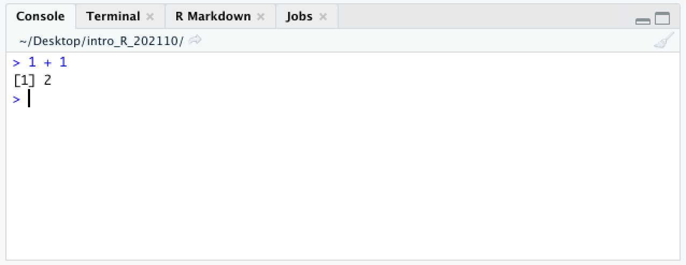

# R and RStudio

## R

[R](https://www.r-project.org/) is a language and environment for statistical computing and graphics developed in the early 1990s. It provides a wide variety of statistical and graphical techniques, including linear and nonlinear modeling, statistical tests, time series analysis, classification, and clustering, among many others.

R:

-   Is free!
-   Is open source and highly extensible, meaning that the user community can (and does) write new R tools
-   Makes publication quality figures, including mathematical symbols and formulae
-   Compiles and runs on Windows, MacOS, and a wide variety of UNIX and Linux systems
-   Has a large and active user community

There are many ways to use R. We can run R from the command line, write R scripts in a text editor and run those on the command line, or use a graphical interface, like RStudio.

## RStudio

RStudio is an integrated development environment (IDE), which offers:

-   Syntax highlighting
-   Code completion
-   Smart indentation
-   Workspace browser
-   Data viewer
-   Embedded plots
-   Notebooks that generate PDF or HTML results
-   Package management

The team behind RStudio are also the authors of a suite of R packages for data science and visualization collectively known as the "tidyverse." We will be using their extremely popular plotting package, ggplot2, later in this course.

# Course overview

This course will focus primarily on the *practical* use of R, rather than it's theoretical foundations. However, the fundamentals of programming are critical to any deeper understanding of R. As we come to each new concept, we will pause to explore and discuss.

In this workshop, we will be covering:

1.  RStudio and R notebooks
2.  Importing data
3.  Data frames
4.  Basic data types
5.  Functions
6.  Exporting data
7.  Basic statistics
8.  Installing packages
9.  Visualizations
10. Troubleshooting

# 1. RStudio and R notebooks

Let's get started! Launch RStudio.

## RStudio

As mentioned above RStudio is a very nice, but optional, IDE for R. All of the code for this course will work just as well on the command line, but RStudio provides a number of features that improve the experience of learning to the basics of R.

Your RStudio window should look something like this:

 On the left hand side is the **console**. This is a command-line interface for R; you type a command, press enter to run it, and the result will appear below.



In R the prompt is a `>` character. When you see this character at the beginning of the line in your console, it means that R is waiting for you to type your next command.


If you press enter before finishing a command, the next line will begin with a `+` character. This lets you know that R is expecting more input.

On the right hand side, are the **workspace (or environment) browser** and the **plots / help** pane.

The workspace browser shows the objects present in the environment. Currently there are none.


If we store the result of our addition in a variable using `<-`, the result is not printed to the console.


Instead, a new value appears in the workspace browser.


The value of the variable a is the result of the addition operation 1 + 1. When typed into the console, the variable is evaluated, and R returns its value, 2.

The `<-` character pair, which looks like a left-pointing arrow, is one of two assignment operators in R. In most situations, it is equivalent to the `=` character.

The lower right pane contains the file browser, plot viewer, and help documentation, which we will be using frequently.

## R notebooks

Create a new R notebook using the menu bar at the top: File \> New File \> R Notebook. A fourth pane will open up containing a template R notebook. It should look something like this:


R notebooks are a special type of **markdown** document incorporating executable R code chunks and their output, along with text that can be formatted using special characters to encode formatting like headings, bold or italic fonts, bullet points, links, and more.

Markdown is designed to be readable as-is, but it can be converted to PDF or HTML. Using an R notebook keeps any commentary, code, and figures for a project in one place, and makes it easy to generate a nicely formatted report. This web page is the product of an R notebook!

New chunks are added by clicking the *Insert Chunk* button on the toolbar or by pressing *Ctrl+Alt+I* on Windows, or *Cmd+Option+I* on Mac.

Code chunks are executed by clicking the *Run* button within the chunk or by placing your cursor inside it and pressing *Ctrl+Shift+Enter* on Windows, or *Cmd+Shift+Enter* on Mac. You can run a single line of code by placing your cursor anywhere on the line and pressing *Ctrl+Enter* on Windows, or *Cmd+Enter* on Mac.

Create and run a new chunk with the following code:

```{r, eval=FALSE}
2 + 2
b <- 3 + 3
```

What happened? Where did the output for each line of code go?

# 2. Importing data

Manual data entry is time-consuming and leads to errors. R has a number of functions for reading data in a variety of formats. Let's use the `read.csv()` function to read in a spreadsheet containing data from an experiment.

```{r}
birthweight <- read.csv("datasets/birthweight.csv")
```

The contents of the CSV file are now stored in the variable "birthweight."

# 3. Data frames

What is the birthweight object? In the enviroment browser, you should see that it is "42 obs. of 18 variables." It's probably a data table with 42 rows and 18 coumns. We can verfiy this using the `class()` and `dim()` functions.

```{r}
class(birthweight)
dim(birthweight)
```

A data frame organizes data into rows and columns. The object must be "rectangular," with all rows having the same number of fields, and all values in a column must be of the same type.

Each column of a data frame is a **vector**. A vector is an ordered collection of values of the same type.

Let's take a look at the contents.

```{r}
birthweight
```

The data frame format should look familiar. It's a lot like a spreadsheet.

## Subsetting a data frame

Generally, we don't want to operate on the entire data frame. For example, to calculate the mean birth weight, we don't need the information in the "paternal.education" column.

There are three ways to subset data: \$, [[, and [.

### Selecting a single column using the \$ and [[ operators

The simplest way to get all the values in the "birthweight" column is with the \$ operator.

```{r}
birthweight$birthweight
mean(birthweight$birthweight)
```

This \$ operator is a shortcut for the [[ sub-setting operator, which requires typing six characters (two pairs of square brackets and a pair of quotation marks). They function in the same way, returning the *value* of the element named.

```{r}
birthweight[["birthweight"]]
mean(birthweight[["birthweight"]])
```

One difference to note is that while [[ works with the **index**, or column number, \$ does not.

```{r}
# which column contains the birthweight?
# lines beginning with a '#' will not be executed by R
colnames(birthweight)
birthweight[[5]]
mean(birthweight[[5]])
# un-comment the following line and see what happens:
#birthweight$5
```

### Selecting a subset of the data frame using the [ operator

Unlike \$ and [[, which return the value(s) contained in the specified element, [ returns an object of the same type it is used to subset. Using [ to retrieve the fifth column will return a data frame with 42 rows and 1 column. This may not seem like a big difference, but it can be an important distinction in some cases.

```{r}
birthweight[5]
```

Because the [ operator returns a new data frame, it can be used to specify multiple rows and / or columns.

```{r}
birthweight[c(1,5)]
```

The `c()` function creates a vector. This allows R to treat indices 1 and 5 as a single argument. This is critical, because `birthweight[1,5]` does not produce the same effect at all.

```{r}
birthweight[1, 5]
```

What happened?

When there are two arguments provided to [, R interprets these as the index on the first (row) and second (column) dimension of the object. The value returned is the content of the first row, fifth column: the birth weight of individual 1107.

```{r}
birthweight[c(2,7,29), c(1,5)]
```

R will also accept row or column names, and the use of the minus sign to exclude indices.

```{r}
colnames(birthweight)
birthweight[c("maternal.cigarettes", "birthweight")]
birthweight[c(1,3,5:13), -c(13:16)]
```

Finally, vectors of logical (TRUE/FALSE) values can be used to subset data. Rows or columns corresponding to "TRUE" elements will be returned, while rows or columns corresponding to "FALSE" elements will be excluded.

```{r}
birthweight[c(1,3,5:13), c(TRUE, TRUE, TRUE, TRUE, TRUE, TRUE, TRUE, TRUE, TRUE, TRUE, TRUE, TRUE, FALSE, FALSE, FALSE, FALSE, TRUE, TRUE)]
```

This is much more useful than it may sound.

```{r}
birthweight$length
birthweight$length < 50
birthweight[birthweight$length < 50, c(1,4:12,17,18)]
```

### Subsetting a vector

A vector, like a column of a data frame, can be subsetted using the [ operator with an index or another vector.

```{r}
birthweight$length[1]
birthweight$length[c(1,2)]
```

Take a few minutes to explore subsetting.

# 4. Basic data types

We have already said that logical values can be used to subset a data frame, and all the values in a given column of a data frame must be of the same type But what does this mean?

When R prints the birthweight data frame, you can see a line with three letter codes like `<int>` and `<chr>` just underneath the column headers. These describe the **class**, or type, of data found in the column. R has the following basic data classes:

-   numeric (includes integer and double)
-   logical
-   character
-   complex
-   raw

Generally, in bioinformatics, values belong to one of the first three classes. Read more about the complex and raw data types [here](https://r-coder.com/data-types-r/).

```{r}
class(birthweight$birthweight)
class(birthweight$geriatric.pregnancy)
class(birthweight$smoker)
```

The integer and numeric categories are fairly self-explanatory. What is a logical?

Logical values are TRUE, FALSE, or NA (missing). Logical values are the result of comparing one item to another with *relational operators*.

```{r}
birthweight[birthweight$head.circumference > 35, c("length", "weeks.gestation", "maternal.height", "paternal.height")]
birthweight[birthweight$maternal.age <= 20, c("location", "maternal.age", "paternal.age")]
birthweight[birthweight$paternal.education == 10, c(1,13:16)]
birthweight[birthweight$weeks.gestation != 40, "weeks.gestation"]
birthweight[birthweight$location == "General",]
```

Many of R's functions also return logical values.

```{r}
is.numeric(birthweight$ID)
is.numeric(birthweight$smoker)
```

### Coercion

The birthweight data frame has three columns that should probably be logical values: "smoker", "low.birthweight", and "geriatric.pregnancy". All of these are questions that can be answered with TRUE/FALSE. However, only "geriatric.pregnancy" is stored as a logical value. Storing "smoker" and "low.birthweight" as logical values would be more useful, since it allows us to subset the data frame more easily.

Changing the class of data is known as **coercion**.

```{r}
as.logical(birthweight$low.birthweight)
as.logical(birthweight$smoker)
```

The `as.logical()` function converted "low.birthweight" to a longical vector, but could not convert "smoker," and returned a vector of missing data denoted by NA. Why is this?

The coercion rule in R is as follows:

logical -\> integer -\> numeric -\> complex -\> character

R can convert between logical values to integers, store integers as the more general numeric type, or represent numeric data as a character, but these coercions cannot always be reversed without losing information.

```{r}
as.numeric(birthweight$geriatric.pregnancy)
```

The `as.logical()` function only operates on "low.birthweight" the way we want because the data was encoded as 0s and 1s. If *any other numbers* were used, the results might be unexpected.

```{r}
as.logical(birthweight$maternal.age)
```

Let's convert the "low.birthweight" column to logical.

```{r}
birthweight$low.birthweight <- as.logical(birthweight$low.birthweight)
birthweight
```

Simple coercion is not going to convert the "smoker" column from character to logical. However, because the result of a relational operation is a vector of logical values, the "yes" and "no" values are easily converted to logical valuess.

```{r}
birthweight$smoker == "yes"
birthweight$smoker <- (birthweight$smoker == "yes")
birthweight
```

Converting the dates (currently stored as characters) to a more useable format is not as simple, and will require another function.

# 5. Functions

R is filled with functions. We have already used a few: `read.csv()`, `class()`, `dim()`, `mean()`, `colnames()`, `as.logical()`, and `as.numeric()`. To find the documentation on a function, use the `?` character. This should open a page containing details on the function in the help pane.

```{r}
?table
table(birthweight$geriatric.pregnancy, birthweight$low.birthweight)
```

Functions are invoked by name, with any arguments provided inside of parentheses. For example, the `chisq.test()` function, which runs a Chi-squared test, requires either a matrix or two vectors as arguments, and provides a number of options that may be set by the user.

```{r}
?chisq.test
chisq.test(birthweight$geriatric.pregnancy, birthweight$low.birthweight)
```

If no parameters are provided to the options, the default values are used.

```{r}
mean(birthweight$birthweight[birthweight$geriatric.pregnancy])
# the ! character is used for negation
mean(birthweight$birthweight[!birthweight$geriatric.pregnancy])
```

In some cases, this is acceptable.

```{r}
mean(birthweight$paternal.age)
mean(birthweight$paternal.age, na.rm = TRUE)
sd(birthweight$paternal.age, na.rm = TRUE)
```

Other times, it is necessary to adjust the options.

## Combining functions

The "birth.date" column is currently stored as a character vector. But what if we wanted to look at the birth weights of babies born in December? Let's split the day, month, and year into separate columns.

R has a function called `strsplit()`:

```{r}
?strsplit
strsplit(birthweight$birth.date, split = "/")
```

This is a good start. However, the output of `strsplit()` is a list containing 42 vectors of length 3, while the columns of birthweight are vectors of length 42.

#### A note on lists:

Lists are ordered collections of objects, which can be of any type. Unlike vectors, lists may contain elements of different types. To subset a list, use the \$ or [[ operator.

```{r}
unlist(strsplit(birthweight$birth.date, split = "/"))
```

When functions are "nested," the operation in the innermost set of parentheses is performed first. In the example above, the `unlist()` function is applied to the output of `strsplit()`, changing a list to a vector. Since the goal was to split one column into three columns, this combination of functions is not effective.

## The apply() family of functions

One of the most useful groups of functions in R is the `apply()` family of functions. This group of functions execute (or *apply*) a provided function to every element of a data structure.

**apply** takes a matrix, applies a function either by row or by column, and returns a vector.

```{r}
# by row
apply(birthweight[,c("maternal.cigarettes", "paternal.cigarettes")], 1, sum)
# by column
apply(birthweight[,c("maternal.cigarettes", "paternal.cigarettes")], 2, sum)
```

**mapply** takes a function and applies it to the elements of one or more vectors.

```{r}
mapply(sum, birthweight$maternal.cigarettes, birthweight$paternal.cigarettes)
```

**tapply** takes two vectors, applies a function to the subsets of the first based on the categories in the second vector, and returns a table.

```{r}
tapply(birthweight$birthweight, birthweight$smoker, mean)
```

**lapply** takes a list, applies a function to each element, and returns a list.

**sapply** takes a list, applies a function to each element, and returns a list that has been simplified as much as possible.

```{r}
lapply(strsplit(birthweight$birth.date, split = "/"), '[[', 1)
sapply(strsplit(birthweight$birth.date, split = "/"), '[[', 1)
```

The result of this nested pair of functions is a vector of months encoded as numbers.

What if we want to do this for all three fields, but we don't want to write the code three times?

Take a few minutes to dissect the following function, working from the inside out. What does each piece do?

```{r}
# custom function takes a vector of dates and returns a data frame with columns day, month, and year
split_MMDDYYYY <- function(date_vector){
  date_list = lapply(seq(1:3), function(i){
    as.integer(sapply(strsplit(date_vector, split = "/"), '[[', i))
  })
  names(date_list) = c("month", "day", "year")
  as.data.frame(do.call("cbind", date_list))
}

split_MMDDYYYY(birthweight$birth.date)
```
```{r}
birthweight <- cbind(birthweight, split_MMDDYYYY(birthweight$birth.date))
```


## Merging data frames
For this example experiment, we also have placental miRNA expression data. These values are not from real samples, due to patient privacy concerns, but have been manipulated to roughly reproduce the effect observed by [Maccani et al. 2010](https://www.tandfonline.com/doi/full/10.4161/epi.5.7.12762).

```{r}
mir <- read.csv("datasets/miRNA.csv", row.names = 1)
mir
```

In this object, the rows are the gene identifiers, and the columns are the samples.

```{r}
mir <- as.data.frame(t(mir))
mir$ID <- gsub("sample.", "", rownames(mir))
experiment <- merge(birthweight, mir)
experiment
```

# 6. Exporting data

```{r}
write.csv(experiment, "experiment.csv")
```


# 7. Statistics

```{r}
experiment
```

## Checking normality

Which variables are normally distributed?
- length
- weight
- cigarettes

```{r}
shapiro.test(experiment$length)
shapiro.test(experiment$birthweight)
shapiro.test(experiment$maternal.cigarettes)
```

## Independent t-test

Do smokers have lighter babies?

```{r}
t.test(experiment[experiment$smoker, "birthweight"],
       experiment[!experiment$smoker, "birthweight"])
```


## Correlation

What is the relationship between gestational age and birth weight?

```{r}
shapiro.test(experiment$weeks.gestation)
cor.test(experiment$weeks.gestation, experiment$birthweight, method = 'pearson')
```

What is the relationship between cigarettes per day and birth weight?

```{r}
cor.test(experiment$maternal.cigarettes, experiment$birthweight, method = 'spearman')
```

## Chi-squared

Is there a relationship between geriatric pregnancy and low birth weight?

```{r}
chisq.test(experiment$geriatric.pregnancy, experiment$low.birthweight)
```

## Linear models

Can maternal height predict length?

```{r}
length.height.model <- lm(length ~ maternal.height, data = experiment)
summary(length.height.model)
```


```{r}
weight.weeksheight.model <- lm(birthweight ~ 0 + weeks.gestation + maternal.height, data = experiment)
summary(weight.weeksheight.model)
```

## Logistic regression

Predict probability of low birth rate with any combination of independent variables

```{r}
weight.smoker.model <- glm(low.birthweight ~ smoker, data = experiment, family = 'binomial')
summary(weight.smoker.model)
weight.cigarettes.model <- glm(low.birthweight ~ maternal.cigarettes, data = experiment, family = 'binomial')
summary(weight.cigarettes.model)
```

# 8. Installing packages

```{r}
if (!("BiocManager" %in% rownames(installed.packages()))){
  install.packages("BiocManager")
}
if (!("ggplot2" %in% rownames(installed.packages()))){
  install.packages("ggplot2")
}
if (!("tidyr" %in% rownames(installed.packages()))){
  install.packages("tidyr")
}
if (!("magrittr" %in% rownames(installed.packages()))){
  install.packages("magrittr")
}
if (!("viridis" %in% rownames(installed.packages()))){
  install.packages("viridis")
}
```

# 9. Visualizations

```{r}
library(ggplot2)
library(tidyr)
library(magrittr)
```

The ggplot2 library is an extremely popular visualization package that provides an interface for extremely fine control over graphics for plotting. It is used by a number of of other popular packages in their built-in plotting functions. It provides a "grammar of graphics" that is quite useful to know.

##### A note about accessibility:

The default colors automatically selected by ggplot2 are not very user-friendly. Colors are chosen by sampling evenly hues on the color wheel. Because of this behavior, all of the colors have similar intensity, which means that they do not work in a gray-scale printing, and may be difficult to distinguish for users with atypical color vision. There are many resources for selecting color palettes online. Here are just a few:

- [Viridis](https://cran.r-project.org/web/packages/viridis/vignettes/intro-to-viridis.html)
- [ColorBrewer](https://colorbrewer2.org/#type=sequential&scheme=BuGn&n=3)
- [colorBlindness Guide](https://cran.r-project.org/web/packages/colorBlindness/vignettes/colorBlindness.html#Collection_of_safe_colors)
- [Digital Accessibility](https://accessibility.digital.gov/visual-design/color-and-contrast/)
- [Blog entry](https://personal.sron.nl/~pault/)

```{r}
library(viridis)
?viridis

locations.palette <- viridis(3)
smoking.palette <- inferno(2, begin = 0.5, direction = -1)
years.palette <- mako(2, begin = 0.4, end = 0.9, direction = -1)
```

## Frequency

```{r}
ggplot(data = experiment, mapping = aes(x = birthweight)) +
  geom_histogram(binwidth = 0.25) +
  facet_wrap(~location, nrow = 3) +
  labs(x = "weight (Kg)", y = "births") +
  theme_bw()
ggplot(data = experiment, mapping = aes(x = birthweight)) +
  geom_density() +
  theme_bw()
ggplot(data = experiment, mapping = aes(x = birthweight)) +
  geom_density() +
  facet_wrap(~location, nrow = 3) +
  theme_bw()
ggplot(data = experiment,
       mapping = aes(x = birthweight,
                     color = location)) +
  geom_density() +
  scale_color_manual(values = locations.palette) +
  theme_bw()
ggplot(data = experiment,
       mapping = aes(x = birthweight,
                     color = as.factor(year))) +
  geom_density() +
  facet_wrap(~as.factor(year), nrow = 1) +
  scale_color_manual(values = years.palette) +
  theme_bw()
```

## Bar chart

```{r}
ggplot(data = experiment,
       mapping = aes(x = as.factor(month), fill = as.factor(year))) +
  geom_bar(position = position_dodge2(preserve = "single")) +
  labs(x = "Birth month", y = "Samples", fill = "Year",
       caption = "Colors: https://personal.sron.nl/~pault/") +
  scale_fill_manual(values = years.palette) +
  theme_bw()
```

## box and violin

```{r}
experiment %>%
  pivot_longer(cols = c(22:25),
               names_to = "gene.id",
               values_to = "expression") %>%
  ggplot(mapping = aes(x = smoker, y = expression, fill = smoker)) +
  geom_boxplot() +
  facet_wrap(~ gene.id, nrow = 2) +
  scale_fill_manual(values = smoking.palette) +
  scale_x_discrete(labels = c("non-smoker", "smoker")) +
  guides(fill = "none") +
  labs(y = "miRNA expression") +
  theme_bw() +
  theme(axis.title.x = element_blank())

experiment %>%
  pivot_longer(cols = c(22:25),
               names_to = "gene.id",
               values_to = "expression") %>%
  ggplot(mapping = aes(x = smoker, y = expression, fill = smoker)) +
  geom_violin() +
  scale_fill_manual(values = smoking.palette) +
  facet_wrap(~ gene.id, nrow = 2) +
  theme_bw()
```

## scatter plots

```{r}
experiment %>%
  pivot_longer(cols = c(22:25),
               names_to = "gene.id",
               values_to = "expression") %>%
  ggplot(mapping = aes(x = maternal.cigarettes, y = expression, color = location)) +
  geom_point() +
  facet_wrap(~ gene.id, nrow = 2) +
  theme_bw()

ggplot(experiment, mapping = aes(x = weeks.gestation, y = birthweight, color = smoker)) +
  geom_point()  +
  theme_bw()
```

```{r}
ggplot(experiment, mapping = aes(x = weeks.gestation, y = birthweight, color = smoker)) +
  geom_point() +
  geom_smooth() +
  theme_bw()
```

## regression?

## Heat map

```{r}

```

# 10. Troubleshooting

Common errors:

- file is not in the right place, or is incorrectly named
- improperly formatted files
- missing values
- spelling errors
- incorrectly named parameters

```{r}

```

