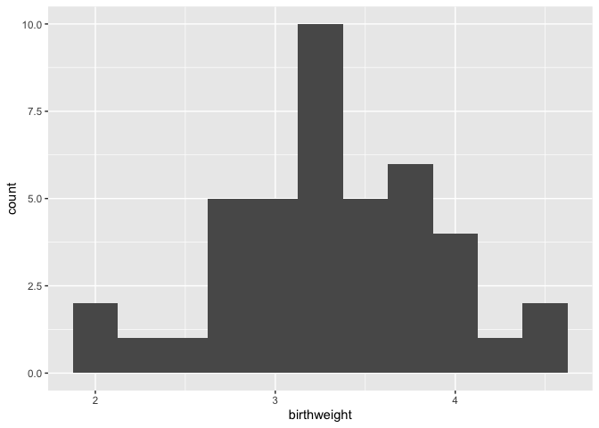
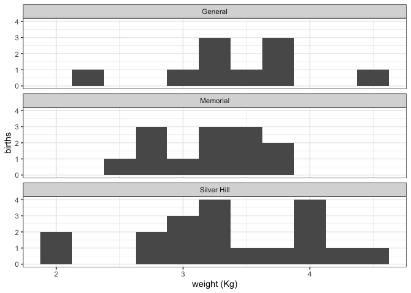
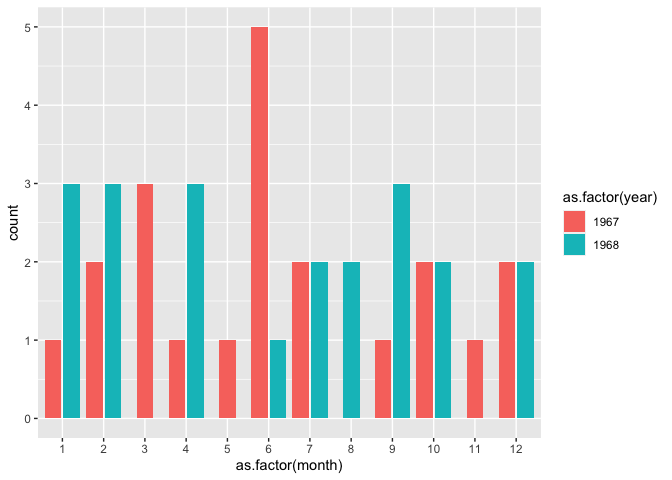
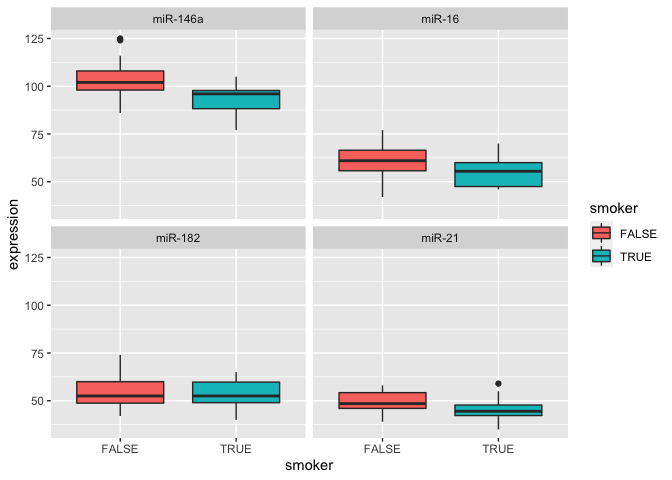
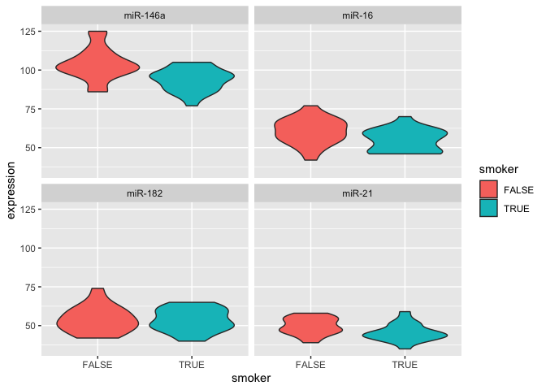
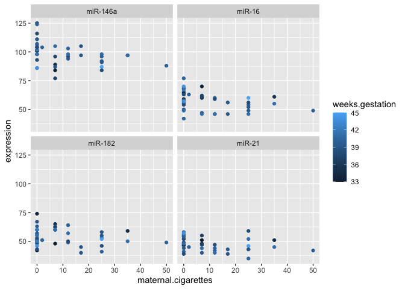
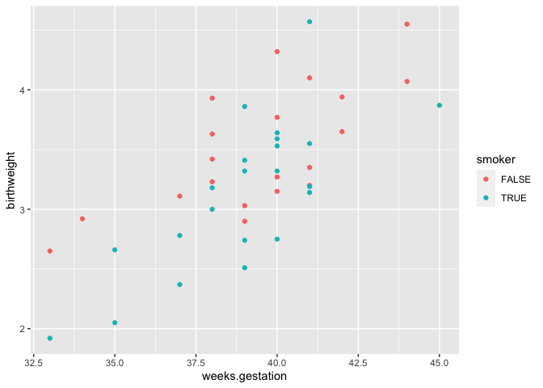
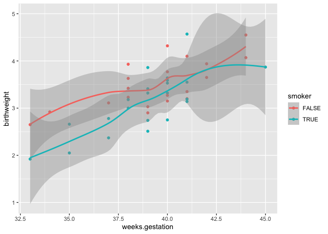

# R and RStudio

## R

[R](https://www.r-project.org/) is a language and environment for statistical computing and graphics developed in the early 1990s. It provides a wide variety of statistical and graphical techniques, including linear and nonlinear modeling, statistical tests, time series analysis, classification, and clustering, among many others.

R:

-   Is free!
-   Is open source and highly extensible, meaning that the user community can (and does) write new R tools
-   Makes publication quality figures, including mathematical symbols and formulae
-   Compiles and runs on Windows, MacOS, and a wide variety of UNIX and Linux systems
-   Has a large and active user community

There are many ways to use R. We can run R from the command line, write R scripts in a text editor and run those on the command line, or use a graphical interface, like RStudio.

## RStudio

RStudio is an integrated development environment (IDE), which offers:

-   Syntax highlighting
-   Code completion
-   Smart indentation
-   Workspace browser
-   Data viewer
-   Embedded plots
-   Notebooks that generate PDF or HTML results
-   Package management

The team behind RStudio are also the authors of a suite of R packages for data science and visualization collectively known as the "tidyverse." We will be using their extremely popular plotting package, ggplot2, later in this course.

# Course overview

This course will focus primarily on the *practical* use of R, rather than it's theoretical foundations. However, the fundamentals of programming are critical to any deeper understanding of R. As we come to each new concept, we will pause to explore and discuss.

In this workshop, we will be covering:

1.  RStudio and R notebooks
2.  Importing data
3.  Data frames
4.  Basic data types
5.  Functions
6.  Exporting data
7.  Basic statistics
8.  Installing packages
9.  Visualizations
10. Troubleshooting

# 1. RStudio and R notebooks

Let's get started! Launch RStudio.

## RStudio

As mentioned above RStudio is a very nice, but optional, IDE for R. All of the code for this course will work just as well on the command line, but RStudio provides a number of features that improve the experience of learning to the basics of R.

Your RStudio window should look something like this:

 On the left hand side is the **console**. This is a command-line interface for R; you type a command, press enter to run it, and the result will appear below.


In R the prompt is a `>` character. When you see this character at the beginning of the line in your console, it means that R is waiting for you to type your next command.


If you press enter before finishing a command, the next line will begin with a `+` character. This lets you know that R is expecting more input.

On the right hand side, are the **workspace (or environment) browser** and the **plots / help** pane.

The workspace browser shows the objects present in the environment. Currently there are none.


If we store the result of our addition in a variable using `<-`, the result is not printed to the console.


Instead, a new value appears in the workspace browser.


The value of the variable a is the result of the addition operation 1 + 1. When typed into the console, the variable is evaluated, and R returns its value, 2.

The `<-` character pair, which looks like a left-pointing arrow, is one of two assignment operators in R. In most situations, it is equivalent to the `=` character.

The lower right pane contains the file browser, plot viewer, and help documentation, which we will be using frequently.

## R notebooks

Create a new R notebook using the menu bar at the top: File \> New File \> R Notebook. A fourth pane will open up containing a template R notebook. It should look something like this:


R notebooks are a special type of **markdown** document incorporating executable R code chunks and their output, along with text that can be formatted using special characters to encode formatting like headings, bold or italic fonts, bullet points, links, and more.

Markdown is designed to be readable as-is, but it can be converted to PDF or HTML. Using an R notebook keeps any commentary, code, and figures for a project in one place, and makes it easy to generate a nicely formatted report. This web page is the product of an R notebook!

New chunks are added by clicking the *Insert Chunk* button on the toolbar or by pressing *Ctrl+Alt+I* on Windows, or *Cmd+Option+I* on Mac.

Code chunks are executed by clicking the *Run* button within the chunk or by placing your cursor inside it and pressing *Ctrl+Shift+Enter* on Windows, or *Cmd+Shift+Enter* on Mac. You can run a single line of code by placing your cursor anywhere on the line and pressing *Ctrl+Enter* on Windows, or *Cmd+Enter* on Mac.

Create and run a new chunk with the following code:


```r
2 + 2
b <- 3 + 3
```

What happened? Where did the output for each line of code go?

# 2. Importing data

Manual data entry is time-consuming and leads to errors. R has a number of functions for reading data in a variety of formats. Let's use the `read.csv()` function to read in a spreadsheet containing data from an experiment.


```r
birthweight <- read.csv("birthweight.csv")
```

The contents of the CSV file are now stored in the variable "birthweight."

# 3. Data frames

What is the birthweight object? In the enviroment browser, you should see that it is "42 obs. of 18 variables." It's probably a data table with 42 rows and 18 coumns. We can verfiy this using the `class()` and `dim()` functions.


```r
class(birthweight)
```

```
## [1] "data.frame"
```

```r
dim(birthweight)
```

```
## [1] 42 18
```

A data frame organizes data into rows and columns. The object must be "rectangular," with all rows having the same number of fields, and all values in a column must be of the same type.

Each column of a data frame is a **vector**. A vector is an ordered collection of values of the same type.

Let's take a look at the contents.


```r
birthweight
```

```
##      ID birth.date    location length birthweight head.circumference
## 1  1107  1/25/1967     General     52        3.23                 36
## 2   697   2/6/1967 Silver Hill     48        3.03                 35
## 3  1683  2/14/1967 Silver Hill     53        3.35                 33
## 4    27   3/9/1967 Silver Hill     53        3.55                 37
## 5  1522  3/13/1967    Memorial     50        2.74                 33
## 6   569  3/23/1967    Memorial     50        2.51                 35
## 7   365  4/23/1967    Memorial     52        3.53                 37
## 8   808   5/5/1967 Silver Hill     48        2.92                 33
## 9  1369   6/4/1967 Silver Hill     49        3.18                 34
## 10 1023   6/7/1967    Memorial     52        3.00                 35
## 11  822  6/14/1967    Memorial     50        3.42                 35
## 12 1272  6/20/1967    Memorial     53        2.75                 32
## 13 1262  6/25/1967 Silver Hill     53        3.19                 34
## 14  575  7/12/1967    Memorial     50        2.78                 30
## 15 1016  7/13/1967 Silver Hill     53        4.32                 36
## 16  792   9/7/1967    Memorial     53        3.64                 38
## 17  820  10/7/1967     General     52        3.77                 34
## 18  752 10/19/1967     General     49        3.32                 36
## 19  619  11/1/1967    Memorial     52        3.41                 33
## 20 1764  12/7/1967 Silver Hill     58        4.57                 39
## 21 1081 12/14/1967 Silver Hill     54        3.63                 38
## 22  516   1/8/1968 Silver Hill     47        2.66                 33
## 23  272  1/10/1968    Memorial     52        3.86                 36
## 24  321  1/21/1968 Silver Hill     48        3.11                 33
## 25 1636   2/2/1968 Silver Hill     51        3.93                 38
## 26 1360  2/16/1968     General     56        4.55                 34
## 27 1388  2/22/1968    Memorial     51        3.14                 33
## 28 1363   4/2/1968     General     48        2.37                 30
## 29 1058  4/24/1968 Silver Hill     53        3.15                 34
## 30  755  4/25/1968    Memorial     53        3.20                 33
## 31  462  6/19/1968 Silver Hill     58        4.10                 39
## 32  300  7/18/1968 Silver Hill     46        2.05                 32
## 33 1088  7/24/1968     General     51        3.27                 36
## 34   57  8/12/1968    Memorial     51        3.32                 38
## 35  553  8/17/1968 Silver Hill     54        3.94                 37
## 36 1191   9/7/1968     General     53        3.65                 33
## 37  431  9/16/1968 Silver Hill     48        1.92                 30
## 38 1313  9/27/1968 Silver Hill     43        2.65                 32
## 39 1600  10/9/1968     General     53        2.90                 34
## 40  532 10/25/1968     General     53        3.59                 34
## 41  223 12/11/1968     General     50        3.87                 33
## 42 1187 12/19/1968 Silver Hill     53        4.07                 38
##    weeks.gestation smoker maternal.age maternal.cigarettes maternal.height
## 1               38     no           31                   0             164
## 2               39     no           27                   0             162
## 3               41     no           27                   0             164
## 4               41    yes           37                  25             161
## 5               39    yes           21                  17             156
## 6               39    yes           22                   7             159
## 7               40    yes           26                  25             170
## 8               34     no           26                   0             167
## 9               38    yes           31                  25             162
## 10              38    yes           30                  12             165
## 11              38     no           20                   0             157
## 12              40    yes           37                  50             168
## 13              41    yes           27                  35             163
## 14              37    yes           19                   7             165
## 15              40     no           19                   0             171
## 16              40    yes           20                   2             170
## 17              40     no           24                   0             157
## 18              40    yes           27                  12             152
## 19              39    yes           23                  25             181
## 20              41    yes           32                  12             173
## 21              38     no           18                   0             172
## 22              35    yes           20                  35             170
## 23              39    yes           30                  25             170
## 24              37     no           28                   0             158
## 25              38     no           29                   0             165
## 26              44     no           20                   0             162
## 27              41    yes           22                   7             160
## 28              37    yes           20                   7             163
## 29              40     no           29                   0             167
## 30              41     no           21                   0             155
## 31              41     no           35                   0             172
## 32              35    yes           41                   7             166
## 33              40     no           24                   0             168
## 34              39    yes           23                  17             157
## 35              42     no           24                   0             175
## 36              42     no           21                   0             165
## 37              33    yes           20                   7             161
## 38              33     no           24                   0             149
## 39              39     no           19                   0             165
## 40              40    yes           31                  12             163
## 41              45    yes           28                  25             163
## 42              44     no           20                   0             174
##    maternal.prepregnant.weight paternal.age paternal.education
## 1                           57           NA                 NA
## 2                           62           27                 14
## 3                           62           37                 14
## 4                           66           46                 NA
## 5                           53           24                 12
## 6                           52           23                 14
## 7                           62           30                 10
## 8                           64           25                 12
## 9                           57           32                 16
## 10                          64           38                 14
## 11                          48           22                 14
## 12                          61           31                 16
## 13                          51           31                 16
## 14                          60           20                 14
## 15                          62           19                 12
## 16                          59           24                 12
## 17                          50           31                 16
## 18                          48           37                 12
## 19                          69           23                 16
## 20                          70           38                 14
## 21                          50           20                 12
## 22                          57           23                 12
## 23                          78           40                 16
## 24                          54           39                 10
## 25                          61           NA                 NA
## 26                          57           23                 10
## 27                          53           24                 16
## 28                          47           20                 10
## 29                          60           30                 16
## 30                          55           25                 14
## 31                          58           31                 16
## 32                          57           37                 14
## 33                          53           29                 16
## 34                          48           NA                 NA
## 35                          66           30                 12
## 36                          61           21                 10
## 37                          50           20                 10
## 38                          45           26                 16
## 39                          57           NA                 NA
## 40                          49           41                 12
## 41                          54           30                 16
## 42                          68           26                 14
##    paternal.cigarettes paternal.height low.birthweight geriatric.pregnancy
## 1                   NA              NA               0               FALSE
## 2                    0             178               0               FALSE
## 3                    0             170               0               FALSE
## 4                    0             175               0                TRUE
## 5                    7             179               0               FALSE
## 6                   25              NA               1               FALSE
## 7                   25             181               0               FALSE
## 8                   25             175               0               FALSE
## 9                   50             194               0               FALSE
## 10                  50             180               0               FALSE
## 11                   0             179               0               FALSE
## 12                   0             173               0                TRUE
## 13                  25             185               0               FALSE
## 14                   0             183               0               FALSE
## 15                   0             183               0               FALSE
## 16                  12             185               0               FALSE
## 17                   0             173               0               FALSE
## 18                  25             170               0               FALSE
## 19                   2             181               0               FALSE
## 20                  25             180               0               FALSE
## 21                   7             172               0               FALSE
## 22                  50             186               1               FALSE
## 23                  50             178               0               FALSE
## 24                   0             171               0               FALSE
## 25                  NA              NA               0               FALSE
## 26                  35             179               0               FALSE
## 27                  12             176               0               FALSE
## 28                  35             185               1               FALSE
## 29                  NA             182               0               FALSE
## 30                  25             183               0               FALSE
## 31                  25             185               0                TRUE
## 32                  25             173               1                TRUE
## 33                   0             181               0               FALSE
## 34                  NA              NA               0               FALSE
## 35                   0             184               0               FALSE
## 36                  25             185               0               FALSE
## 37                  35             180               1               FALSE
## 38                   0             169               1               FALSE
## 39                  NA              NA               0               FALSE
## 40                  50             191               0               FALSE
## 41                   0             183               0               FALSE
## 42                  25             189               0               FALSE
```

The data frame format should look familiar. It's a lot like a spreadsheet.

## Subsetting a data frame

Generally, we don't want to operate on the entire data frame. For example, to calculate the mean birth weight, we don't need the information in the "paternal.education" column.

There are three ways to subset data: \$, [[, and [.

### Selecting a single column using the \$ and [[ operators

The simplest way to get all the values in the "birthweight" column is with the \$ operator.


```r
birthweight$birthweight
```

```
##  [1] 3.23 3.03 3.35 3.55 2.74 2.51 3.53 2.92 3.18 3.00 3.42 2.75 3.19 2.78 4.32
## [16] 3.64 3.77 3.32 3.41 4.57 3.63 2.66 3.86 3.11 3.93 4.55 3.14 2.37 3.15 3.20
## [31] 4.10 2.05 3.27 3.32 3.94 3.65 1.92 2.65 2.90 3.59 3.87 4.07
```

```r
mean(birthweight$birthweight)
```

```
## [1] 3.312857
```

This \$ operator is a shortcut for the [[ sub-setting operator, which requires typing six characters (two pairs of square brackets and a pair of quotation marks). They function in the same way, returning the *value* of the element named.


```r
birthweight[["birthweight"]]
```

```
##  [1] 3.23 3.03 3.35 3.55 2.74 2.51 3.53 2.92 3.18 3.00 3.42 2.75 3.19 2.78 4.32
## [16] 3.64 3.77 3.32 3.41 4.57 3.63 2.66 3.86 3.11 3.93 4.55 3.14 2.37 3.15 3.20
## [31] 4.10 2.05 3.27 3.32 3.94 3.65 1.92 2.65 2.90 3.59 3.87 4.07
```

```r
mean(birthweight[["birthweight"]])
```

```
## [1] 3.312857
```

One difference to note is that while [[ works with the **index**, or column number, \$ does not.


```r
# which column contains the birthweight?
# lines beginning with a '#' will not be executed by R
colnames(birthweight)
```

```
##  [1] "ID"                          "birth.date"                 
##  [3] "location"                    "length"                     
##  [5] "birthweight"                 "head.circumference"         
##  [7] "weeks.gestation"             "smoker"                     
##  [9] "maternal.age"                "maternal.cigarettes"        
## [11] "maternal.height"             "maternal.prepregnant.weight"
## [13] "paternal.age"                "paternal.education"         
## [15] "paternal.cigarettes"         "paternal.height"            
## [17] "low.birthweight"             "geriatric.pregnancy"
```

```r
birthweight[[5]]
```

```
##  [1] 3.23 3.03 3.35 3.55 2.74 2.51 3.53 2.92 3.18 3.00 3.42 2.75 3.19 2.78 4.32
## [16] 3.64 3.77 3.32 3.41 4.57 3.63 2.66 3.86 3.11 3.93 4.55 3.14 2.37 3.15 3.20
## [31] 4.10 2.05 3.27 3.32 3.94 3.65 1.92 2.65 2.90 3.59 3.87 4.07
```

```r
mean(birthweight[[5]])
```

```
## [1] 3.312857
```

```r
# un-comment the following line and see what happens:
#birthweight$5
```

### Selecting a subset of the data frame using the [ operator

Unlike \$ and [[, which return the value(s) contained in the specified element, [ returns an object of the same type it is used to subset. Using [ to retrieve the fifth column will return a data frame with 42 rows and 1 column. This may not seem like a big difference, but it can be an important distinction in some cases.


```r
birthweight[5]
```

```
##    birthweight
## 1         3.23
## 2         3.03
## 3         3.35
## 4         3.55
## 5         2.74
## 6         2.51
## 7         3.53
## 8         2.92
## 9         3.18
## 10        3.00
## 11        3.42
## 12        2.75
## 13        3.19
## 14        2.78
## 15        4.32
## 16        3.64
## 17        3.77
## 18        3.32
## 19        3.41
## 20        4.57
## 21        3.63
## 22        2.66
## 23        3.86
## 24        3.11
## 25        3.93
## 26        4.55
## 27        3.14
## 28        2.37
## 29        3.15
## 30        3.20
## 31        4.10
## 32        2.05
## 33        3.27
## 34        3.32
## 35        3.94
## 36        3.65
## 37        1.92
## 38        2.65
## 39        2.90
## 40        3.59
## 41        3.87
## 42        4.07
```

Because the [ operator returns a new data frame, it can be used to specify multiple rows and / or columns.


```r
birthweight[c(1,5)]
```

```
##      ID birthweight
## 1  1107        3.23
## 2   697        3.03
## 3  1683        3.35
## 4    27        3.55
## 5  1522        2.74
## 6   569        2.51
## 7   365        3.53
## 8   808        2.92
## 9  1369        3.18
## 10 1023        3.00
## 11  822        3.42
## 12 1272        2.75
## 13 1262        3.19
## 14  575        2.78
## 15 1016        4.32
## 16  792        3.64
## 17  820        3.77
## 18  752        3.32
## 19  619        3.41
## 20 1764        4.57
## 21 1081        3.63
## 22  516        2.66
## 23  272        3.86
## 24  321        3.11
## 25 1636        3.93
## 26 1360        4.55
## 27 1388        3.14
## 28 1363        2.37
## 29 1058        3.15
## 30  755        3.20
## 31  462        4.10
## 32  300        2.05
## 33 1088        3.27
## 34   57        3.32
## 35  553        3.94
## 36 1191        3.65
## 37  431        1.92
## 38 1313        2.65
## 39 1600        2.90
## 40  532        3.59
## 41  223        3.87
## 42 1187        4.07
```

The `c()` function creates a vector. This allows R to treat indices 1 and 5 as a single argument. This is critical, because `birthweight[1,5]` does not produce the same effect at all.


```r
birthweight[1, 5]
```

```
## [1] 3.23
```

What happened?

When there are two arguments provided to [, R interprets these as the index on the first (row) and second (column) dimension of the object. The value returned is the content of the first row, fifth column: the birth weight of individual 1107.


```r
birthweight[c(2,7,29), c(1,5)]
```

```
##      ID birthweight
## 2   697        3.03
## 7   365        3.53
## 29 1058        3.15
```

R will also accept row or column names, and the use of the minus sign to exclude indices.


```r
colnames(birthweight)
```

```
##  [1] "ID"                          "birth.date"                 
##  [3] "location"                    "length"                     
##  [5] "birthweight"                 "head.circumference"         
##  [7] "weeks.gestation"             "smoker"                     
##  [9] "maternal.age"                "maternal.cigarettes"        
## [11] "maternal.height"             "maternal.prepregnant.weight"
## [13] "paternal.age"                "paternal.education"         
## [15] "paternal.cigarettes"         "paternal.height"            
## [17] "low.birthweight"             "geriatric.pregnancy"
```

```r
birthweight[c("maternal.cigarettes", "birthweight")]
```

```
##    maternal.cigarettes birthweight
## 1                    0        3.23
## 2                    0        3.03
## 3                    0        3.35
## 4                   25        3.55
## 5                   17        2.74
## 6                    7        2.51
## 7                   25        3.53
## 8                    0        2.92
## 9                   25        3.18
## 10                  12        3.00
## 11                   0        3.42
## 12                  50        2.75
## 13                  35        3.19
## 14                   7        2.78
## 15                   0        4.32
## 16                   2        3.64
## 17                   0        3.77
## 18                  12        3.32
## 19                  25        3.41
## 20                  12        4.57
## 21                   0        3.63
## 22                  35        2.66
## 23                  25        3.86
## 24                   0        3.11
## 25                   0        3.93
## 26                   0        4.55
## 27                   7        3.14
## 28                   7        2.37
## 29                   0        3.15
## 30                   0        3.20
## 31                   0        4.10
## 32                   7        2.05
## 33                   0        3.27
## 34                  17        3.32
## 35                   0        3.94
## 36                   0        3.65
## 37                   7        1.92
## 38                   0        2.65
## 39                   0        2.90
## 40                  12        3.59
## 41                  25        3.87
## 42                   0        4.07
```

```r
birthweight[c(1,3,5:13), -c(13:16)]
```

```
##      ID birth.date    location length birthweight head.circumference
## 1  1107  1/25/1967     General     52        3.23                 36
## 3  1683  2/14/1967 Silver Hill     53        3.35                 33
## 5  1522  3/13/1967    Memorial     50        2.74                 33
## 6   569  3/23/1967    Memorial     50        2.51                 35
## 7   365  4/23/1967    Memorial     52        3.53                 37
## 8   808   5/5/1967 Silver Hill     48        2.92                 33
## 9  1369   6/4/1967 Silver Hill     49        3.18                 34
## 10 1023   6/7/1967    Memorial     52        3.00                 35
## 11  822  6/14/1967    Memorial     50        3.42                 35
## 12 1272  6/20/1967    Memorial     53        2.75                 32
## 13 1262  6/25/1967 Silver Hill     53        3.19                 34
##    weeks.gestation smoker maternal.age maternal.cigarettes maternal.height
## 1               38     no           31                   0             164
## 3               41     no           27                   0             164
## 5               39    yes           21                  17             156
## 6               39    yes           22                   7             159
## 7               40    yes           26                  25             170
## 8               34     no           26                   0             167
## 9               38    yes           31                  25             162
## 10              38    yes           30                  12             165
## 11              38     no           20                   0             157
## 12              40    yes           37                  50             168
## 13              41    yes           27                  35             163
##    maternal.prepregnant.weight low.birthweight geriatric.pregnancy
## 1                           57               0               FALSE
## 3                           62               0               FALSE
## 5                           53               0               FALSE
## 6                           52               1               FALSE
## 7                           62               0               FALSE
## 8                           64               0               FALSE
## 9                           57               0               FALSE
## 10                          64               0               FALSE
## 11                          48               0               FALSE
## 12                          61               0                TRUE
## 13                          51               0               FALSE
```

Finally, vectors of logical (TRUE/FALSE) values can be used to subset data. Rows or columns corresponding to "TRUE" elements will be returned, while rows or columns corresponding to "FALSE" elements will be excluded.


```r
birthweight[c(1,3,5:13), c(TRUE, TRUE, TRUE, TRUE, TRUE, TRUE, TRUE, TRUE, TRUE, TRUE, TRUE, TRUE, FALSE, FALSE, FALSE, FALSE, TRUE, TRUE)]
```

```
##      ID birth.date    location length birthweight head.circumference
## 1  1107  1/25/1967     General     52        3.23                 36
## 3  1683  2/14/1967 Silver Hill     53        3.35                 33
## 5  1522  3/13/1967    Memorial     50        2.74                 33
## 6   569  3/23/1967    Memorial     50        2.51                 35
## 7   365  4/23/1967    Memorial     52        3.53                 37
## 8   808   5/5/1967 Silver Hill     48        2.92                 33
## 9  1369   6/4/1967 Silver Hill     49        3.18                 34
## 10 1023   6/7/1967    Memorial     52        3.00                 35
## 11  822  6/14/1967    Memorial     50        3.42                 35
## 12 1272  6/20/1967    Memorial     53        2.75                 32
## 13 1262  6/25/1967 Silver Hill     53        3.19                 34
##    weeks.gestation smoker maternal.age maternal.cigarettes maternal.height
## 1               38     no           31                   0             164
## 3               41     no           27                   0             164
## 5               39    yes           21                  17             156
## 6               39    yes           22                   7             159
## 7               40    yes           26                  25             170
## 8               34     no           26                   0             167
## 9               38    yes           31                  25             162
## 10              38    yes           30                  12             165
## 11              38     no           20                   0             157
## 12              40    yes           37                  50             168
## 13              41    yes           27                  35             163
##    maternal.prepregnant.weight low.birthweight geriatric.pregnancy
## 1                           57               0               FALSE
## 3                           62               0               FALSE
## 5                           53               0               FALSE
## 6                           52               1               FALSE
## 7                           62               0               FALSE
## 8                           64               0               FALSE
## 9                           57               0               FALSE
## 10                          64               0               FALSE
## 11                          48               0               FALSE
## 12                          61               0                TRUE
## 13                          51               0               FALSE
```

This is much more useful than it may sound.


```r
birthweight$length
```

```
##  [1] 52 48 53 53 50 50 52 48 49 52 50 53 53 50 53 53 52 49 52 58 54 47 52 48 51
## [26] 56 51 48 53 53 58 46 51 51 54 53 48 43 53 53 50 53
```

```r
birthweight$length < 50
```

```
##  [1] FALSE  TRUE FALSE FALSE FALSE FALSE FALSE  TRUE  TRUE FALSE FALSE FALSE
## [13] FALSE FALSE FALSE FALSE FALSE  TRUE FALSE FALSE FALSE  TRUE FALSE  TRUE
## [25] FALSE FALSE FALSE  TRUE FALSE FALSE FALSE  TRUE FALSE FALSE FALSE FALSE
## [37]  TRUE  TRUE FALSE FALSE FALSE FALSE
```

```r
birthweight[birthweight$length < 50, c(1,4:12,17,18)]
```

```
##      ID length birthweight head.circumference weeks.gestation smoker
## 2   697     48        3.03                 35              39     no
## 8   808     48        2.92                 33              34     no
## 9  1369     49        3.18                 34              38    yes
## 18  752     49        3.32                 36              40    yes
## 22  516     47        2.66                 33              35    yes
## 24  321     48        3.11                 33              37     no
## 28 1363     48        2.37                 30              37    yes
## 32  300     46        2.05                 32              35    yes
## 37  431     48        1.92                 30              33    yes
## 38 1313     43        2.65                 32              33     no
##    maternal.age maternal.cigarettes maternal.height maternal.prepregnant.weight
## 2            27                   0             162                          62
## 8            26                   0             167                          64
## 9            31                  25             162                          57
## 18           27                  12             152                          48
## 22           20                  35             170                          57
## 24           28                   0             158                          54
## 28           20                   7             163                          47
## 32           41                   7             166                          57
## 37           20                   7             161                          50
## 38           24                   0             149                          45
##    low.birthweight geriatric.pregnancy
## 2                0               FALSE
## 8                0               FALSE
## 9                0               FALSE
## 18               0               FALSE
## 22               1               FALSE
## 24               0               FALSE
## 28               1               FALSE
## 32               1                TRUE
## 37               1               FALSE
## 38               1               FALSE
```

### Subsetting a vector

A vector, like a column of a data frame, can be subsetted using the [ operator with an index or another vector.


```r
birthweight$length[1]
```

```
## [1] 52
```

```r
birthweight$length[c(1,2)]
```

```
## [1] 52 48
```

Take a few minutes to explore subsetting.

# 4. Basic data types

We have already said that logical values can be used to subset a data frame, and all the values in a given column of a data frame must be of the same type But what does this mean?

When R prints the birthweight data frame, you can see a line with three letter codes like `<int>` and `<chr>` just underneath the column headers. These describe the **class**, or type, of data found in the column. R has the following basic data classes:

-   numeric (includes integer and double)
-   logical
-   character
-   complex
-   raw

Generally, in bioinformatics, values belong to one of the first three classes. Read more about the complex and raw data types [here](https://r-coder.com/data-types-r/).


```r
class(birthweight$birthweight)
```

```
## [1] "numeric"
```

```r
class(birthweight$geriatric.pregnancy)
```

```
## [1] "logical"
```

```r
class(birthweight$smoker)
```

```
## [1] "character"
```

The integer and numeric categories are fairly self-explanatory. What is a logical?

Logical values are TRUE, FALSE, or NA (missing). Logical values are the result of comparing one item to another with *relational operators*.


```r
birthweight[birthweight$head.circumference > 35, c("length", "weeks.gestation", "maternal.height", "paternal.height")]
```

```
##    length weeks.gestation maternal.height paternal.height
## 1      52              38             164              NA
## 4      53              41             161             175
## 7      52              40             170             181
## 15     53              40             171             183
## 16     53              40             170             185
## 18     49              40             152             170
## 20     58              41             173             180
## 21     54              38             172             172
## 23     52              39             170             178
## 25     51              38             165              NA
## 31     58              41             172             185
## 33     51              40             168             181
## 34     51              39             157              NA
## 35     54              42             175             184
## 42     53              44             174             189
```

```r
birthweight[birthweight$maternal.age <= 20, c("location", "maternal.age", "paternal.age")]
```

```
##       location maternal.age paternal.age
## 11    Memorial           20           22
## 14    Memorial           19           20
## 15 Silver Hill           19           19
## 16    Memorial           20           24
## 21 Silver Hill           18           20
## 22 Silver Hill           20           23
## 26     General           20           23
## 28     General           20           20
## 37 Silver Hill           20           20
## 39     General           19           NA
## 42 Silver Hill           20           26
```

```r
birthweight[birthweight$paternal.education == 10, c(1,13:16)]
```

```
##        ID paternal.age paternal.education paternal.cigarettes paternal.height
## NA     NA           NA                 NA                  NA              NA
## NA.1   NA           NA                 NA                  NA              NA
## 7     365           30                 10                  25             181
## 24    321           39                 10                   0             171
## NA.2   NA           NA                 NA                  NA              NA
## 26   1360           23                 10                  35             179
## 28   1363           20                 10                  35             185
## NA.3   NA           NA                 NA                  NA              NA
## 36   1191           21                 10                  25             185
## 37    431           20                 10                  35             180
## NA.4   NA           NA                 NA                  NA              NA
```

```r
birthweight[birthweight$weeks.gestation != 40, "weeks.gestation"]
```

```
##  [1] 38 39 41 41 39 39 34 38 38 38 41 37 39 41 38 35 39 37 38 44 41 37 41 41 35
## [26] 39 42 42 33 33 39 45 44
```

```r
birthweight[birthweight$location == "General",]
```

```
##      ID birth.date location length birthweight head.circumference
## 1  1107  1/25/1967  General     52        3.23                 36
## 17  820  10/7/1967  General     52        3.77                 34
## 18  752 10/19/1967  General     49        3.32                 36
## 26 1360  2/16/1968  General     56        4.55                 34
## 28 1363   4/2/1968  General     48        2.37                 30
## 33 1088  7/24/1968  General     51        3.27                 36
## 36 1191   9/7/1968  General     53        3.65                 33
## 39 1600  10/9/1968  General     53        2.90                 34
## 40  532 10/25/1968  General     53        3.59                 34
## 41  223 12/11/1968  General     50        3.87                 33
##    weeks.gestation smoker maternal.age maternal.cigarettes maternal.height
## 1               38     no           31                   0             164
## 17              40     no           24                   0             157
## 18              40    yes           27                  12             152
## 26              44     no           20                   0             162
## 28              37    yes           20                   7             163
## 33              40     no           24                   0             168
## 36              42     no           21                   0             165
## 39              39     no           19                   0             165
## 40              40    yes           31                  12             163
## 41              45    yes           28                  25             163
##    maternal.prepregnant.weight paternal.age paternal.education
## 1                           57           NA                 NA
## 17                          50           31                 16
## 18                          48           37                 12
## 26                          57           23                 10
## 28                          47           20                 10
## 33                          53           29                 16
## 36                          61           21                 10
## 39                          57           NA                 NA
## 40                          49           41                 12
## 41                          54           30                 16
##    paternal.cigarettes paternal.height low.birthweight geriatric.pregnancy
## 1                   NA              NA               0               FALSE
## 17                   0             173               0               FALSE
## 18                  25             170               0               FALSE
## 26                  35             179               0               FALSE
## 28                  35             185               1               FALSE
## 33                   0             181               0               FALSE
## 36                  25             185               0               FALSE
## 39                  NA              NA               0               FALSE
## 40                  50             191               0               FALSE
## 41                   0             183               0               FALSE
```

Many of R's functions also return logical values.


```r
is.numeric(birthweight$ID)
```

```
## [1] TRUE
```

```r
is.numeric(birthweight$smoker)
```

```
## [1] FALSE
```

### Coercion

The birthweight data frame has three columns that should probably be logical values: "smoker", "low.birthweight", and "geriatric.pregnancy". All of these are questions that can be answered with TRUE/FALSE. However, only "geriatric.pregnancy" is stored as a logical value. Storing "smoker" and "low.birthweight" as logical values would be more useful, since it allows us to subset the data frame more easily.

Changing the class of data is known as **coercion**.


```r
as.logical(birthweight$low.birthweight)
```

```
##  [1] FALSE FALSE FALSE FALSE FALSE  TRUE FALSE FALSE FALSE FALSE FALSE FALSE
## [13] FALSE FALSE FALSE FALSE FALSE FALSE FALSE FALSE FALSE  TRUE FALSE FALSE
## [25] FALSE FALSE FALSE  TRUE FALSE FALSE FALSE  TRUE FALSE FALSE FALSE FALSE
## [37]  TRUE  TRUE FALSE FALSE FALSE FALSE
```

```r
as.logical(birthweight$smoker)
```

```
##  [1] NA NA NA NA NA NA NA NA NA NA NA NA NA NA NA NA NA NA NA NA NA NA NA NA NA
## [26] NA NA NA NA NA NA NA NA NA NA NA NA NA NA NA NA NA
```

The `as.logical()` function converted "low.birthweight" to a longical vector, but could not convert "smoker," and returned a vector of missing data denoted by NA. Why is this?

The coercion rule in R is as follows:

logical -\> integer -\> numeric -\> complex -\> character

R can convert between logical values to integers, store integers as the more general numeric type, or represent numeric data as a character, but these coercions cannot always be reversed without losing information.


```r
as.numeric(birthweight$geriatric.pregnancy)
```

```
##  [1] 0 0 0 1 0 0 0 0 0 0 0 1 0 0 0 0 0 0 0 0 0 0 0 0 0 0 0 0 0 0 1 1 0 0 0 0 0 0
## [39] 0 0 0 0
```

The `as.logical()` function only operates on "low.birthweight" the way we want because the data was encoded as 0s and 1s. If *any other numbers* were used, the results might be unexpected.


```r
as.logical(birthweight$maternal.age)
```

```
##  [1] TRUE TRUE TRUE TRUE TRUE TRUE TRUE TRUE TRUE TRUE TRUE TRUE TRUE TRUE TRUE
## [16] TRUE TRUE TRUE TRUE TRUE TRUE TRUE TRUE TRUE TRUE TRUE TRUE TRUE TRUE TRUE
## [31] TRUE TRUE TRUE TRUE TRUE TRUE TRUE TRUE TRUE TRUE TRUE TRUE
```

Let's convert the "low.birthweight" column to logical.


```r
birthweight$low.birthweight <- as.logical(birthweight$low.birthweight)
birthweight
```

```
##      ID birth.date    location length birthweight head.circumference
## 1  1107  1/25/1967     General     52        3.23                 36
## 2   697   2/6/1967 Silver Hill     48        3.03                 35
## 3  1683  2/14/1967 Silver Hill     53        3.35                 33
## 4    27   3/9/1967 Silver Hill     53        3.55                 37
## 5  1522  3/13/1967    Memorial     50        2.74                 33
## 6   569  3/23/1967    Memorial     50        2.51                 35
## 7   365  4/23/1967    Memorial     52        3.53                 37
## 8   808   5/5/1967 Silver Hill     48        2.92                 33
## 9  1369   6/4/1967 Silver Hill     49        3.18                 34
## 10 1023   6/7/1967    Memorial     52        3.00                 35
## 11  822  6/14/1967    Memorial     50        3.42                 35
## 12 1272  6/20/1967    Memorial     53        2.75                 32
## 13 1262  6/25/1967 Silver Hill     53        3.19                 34
## 14  575  7/12/1967    Memorial     50        2.78                 30
## 15 1016  7/13/1967 Silver Hill     53        4.32                 36
## 16  792   9/7/1967    Memorial     53        3.64                 38
## 17  820  10/7/1967     General     52        3.77                 34
## 18  752 10/19/1967     General     49        3.32                 36
## 19  619  11/1/1967    Memorial     52        3.41                 33
## 20 1764  12/7/1967 Silver Hill     58        4.57                 39
## 21 1081 12/14/1967 Silver Hill     54        3.63                 38
## 22  516   1/8/1968 Silver Hill     47        2.66                 33
## 23  272  1/10/1968    Memorial     52        3.86                 36
## 24  321  1/21/1968 Silver Hill     48        3.11                 33
## 25 1636   2/2/1968 Silver Hill     51        3.93                 38
## 26 1360  2/16/1968     General     56        4.55                 34
## 27 1388  2/22/1968    Memorial     51        3.14                 33
## 28 1363   4/2/1968     General     48        2.37                 30
## 29 1058  4/24/1968 Silver Hill     53        3.15                 34
## 30  755  4/25/1968    Memorial     53        3.20                 33
## 31  462  6/19/1968 Silver Hill     58        4.10                 39
## 32  300  7/18/1968 Silver Hill     46        2.05                 32
## 33 1088  7/24/1968     General     51        3.27                 36
## 34   57  8/12/1968    Memorial     51        3.32                 38
## 35  553  8/17/1968 Silver Hill     54        3.94                 37
## 36 1191   9/7/1968     General     53        3.65                 33
## 37  431  9/16/1968 Silver Hill     48        1.92                 30
## 38 1313  9/27/1968 Silver Hill     43        2.65                 32
## 39 1600  10/9/1968     General     53        2.90                 34
## 40  532 10/25/1968     General     53        3.59                 34
## 41  223 12/11/1968     General     50        3.87                 33
## 42 1187 12/19/1968 Silver Hill     53        4.07                 38
##    weeks.gestation smoker maternal.age maternal.cigarettes maternal.height
## 1               38     no           31                   0             164
## 2               39     no           27                   0             162
## 3               41     no           27                   0             164
## 4               41    yes           37                  25             161
## 5               39    yes           21                  17             156
## 6               39    yes           22                   7             159
## 7               40    yes           26                  25             170
## 8               34     no           26                   0             167
## 9               38    yes           31                  25             162
## 10              38    yes           30                  12             165
## 11              38     no           20                   0             157
## 12              40    yes           37                  50             168
## 13              41    yes           27                  35             163
## 14              37    yes           19                   7             165
## 15              40     no           19                   0             171
## 16              40    yes           20                   2             170
## 17              40     no           24                   0             157
## 18              40    yes           27                  12             152
## 19              39    yes           23                  25             181
## 20              41    yes           32                  12             173
## 21              38     no           18                   0             172
## 22              35    yes           20                  35             170
## 23              39    yes           30                  25             170
## 24              37     no           28                   0             158
## 25              38     no           29                   0             165
## 26              44     no           20                   0             162
## 27              41    yes           22                   7             160
## 28              37    yes           20                   7             163
## 29              40     no           29                   0             167
## 30              41     no           21                   0             155
## 31              41     no           35                   0             172
## 32              35    yes           41                   7             166
## 33              40     no           24                   0             168
## 34              39    yes           23                  17             157
## 35              42     no           24                   0             175
## 36              42     no           21                   0             165
## 37              33    yes           20                   7             161
## 38              33     no           24                   0             149
## 39              39     no           19                   0             165
## 40              40    yes           31                  12             163
## 41              45    yes           28                  25             163
## 42              44     no           20                   0             174
##    maternal.prepregnant.weight paternal.age paternal.education
## 1                           57           NA                 NA
## 2                           62           27                 14
## 3                           62           37                 14
## 4                           66           46                 NA
## 5                           53           24                 12
## 6                           52           23                 14
## 7                           62           30                 10
## 8                           64           25                 12
## 9                           57           32                 16
## 10                          64           38                 14
## 11                          48           22                 14
## 12                          61           31                 16
## 13                          51           31                 16
## 14                          60           20                 14
## 15                          62           19                 12
## 16                          59           24                 12
## 17                          50           31                 16
## 18                          48           37                 12
## 19                          69           23                 16
## 20                          70           38                 14
## 21                          50           20                 12
## 22                          57           23                 12
## 23                          78           40                 16
## 24                          54           39                 10
## 25                          61           NA                 NA
## 26                          57           23                 10
## 27                          53           24                 16
## 28                          47           20                 10
## 29                          60           30                 16
## 30                          55           25                 14
## 31                          58           31                 16
## 32                          57           37                 14
## 33                          53           29                 16
## 34                          48           NA                 NA
## 35                          66           30                 12
## 36                          61           21                 10
## 37                          50           20                 10
## 38                          45           26                 16
## 39                          57           NA                 NA
## 40                          49           41                 12
## 41                          54           30                 16
## 42                          68           26                 14
##    paternal.cigarettes paternal.height low.birthweight geriatric.pregnancy
## 1                   NA              NA           FALSE               FALSE
## 2                    0             178           FALSE               FALSE
## 3                    0             170           FALSE               FALSE
## 4                    0             175           FALSE                TRUE
## 5                    7             179           FALSE               FALSE
## 6                   25              NA            TRUE               FALSE
## 7                   25             181           FALSE               FALSE
## 8                   25             175           FALSE               FALSE
## 9                   50             194           FALSE               FALSE
## 10                  50             180           FALSE               FALSE
## 11                   0             179           FALSE               FALSE
## 12                   0             173           FALSE                TRUE
## 13                  25             185           FALSE               FALSE
## 14                   0             183           FALSE               FALSE
## 15                   0             183           FALSE               FALSE
## 16                  12             185           FALSE               FALSE
## 17                   0             173           FALSE               FALSE
## 18                  25             170           FALSE               FALSE
## 19                   2             181           FALSE               FALSE
## 20                  25             180           FALSE               FALSE
## 21                   7             172           FALSE               FALSE
## 22                  50             186            TRUE               FALSE
## 23                  50             178           FALSE               FALSE
## 24                   0             171           FALSE               FALSE
## 25                  NA              NA           FALSE               FALSE
## 26                  35             179           FALSE               FALSE
## 27                  12             176           FALSE               FALSE
## 28                  35             185            TRUE               FALSE
## 29                  NA             182           FALSE               FALSE
## 30                  25             183           FALSE               FALSE
## 31                  25             185           FALSE                TRUE
## 32                  25             173            TRUE                TRUE
## 33                   0             181           FALSE               FALSE
## 34                  NA              NA           FALSE               FALSE
## 35                   0             184           FALSE               FALSE
## 36                  25             185           FALSE               FALSE
## 37                  35             180            TRUE               FALSE
## 38                   0             169            TRUE               FALSE
## 39                  NA              NA           FALSE               FALSE
## 40                  50             191           FALSE               FALSE
## 41                   0             183           FALSE               FALSE
## 42                  25             189           FALSE               FALSE
```

Simple coercion is not going to convert the "smoker" column from character to logical. However, because the result of a relational operation is a vector of logical values, the "yes" and "no" values are easily converted to logical valuess.


```r
birthweight$smoker == "yes"
```

```
##  [1] FALSE FALSE FALSE  TRUE  TRUE  TRUE  TRUE FALSE  TRUE  TRUE FALSE  TRUE
## [13]  TRUE  TRUE FALSE  TRUE FALSE  TRUE  TRUE  TRUE FALSE  TRUE  TRUE FALSE
## [25] FALSE FALSE  TRUE  TRUE FALSE FALSE FALSE  TRUE FALSE  TRUE FALSE FALSE
## [37]  TRUE FALSE FALSE  TRUE  TRUE FALSE
```

```r
birthweight$smoker <- (birthweight$smoker == "yes")
birthweight
```

```
##      ID birth.date    location length birthweight head.circumference
## 1  1107  1/25/1967     General     52        3.23                 36
## 2   697   2/6/1967 Silver Hill     48        3.03                 35
## 3  1683  2/14/1967 Silver Hill     53        3.35                 33
## 4    27   3/9/1967 Silver Hill     53        3.55                 37
## 5  1522  3/13/1967    Memorial     50        2.74                 33
## 6   569  3/23/1967    Memorial     50        2.51                 35
## 7   365  4/23/1967    Memorial     52        3.53                 37
## 8   808   5/5/1967 Silver Hill     48        2.92                 33
## 9  1369   6/4/1967 Silver Hill     49        3.18                 34
## 10 1023   6/7/1967    Memorial     52        3.00                 35
## 11  822  6/14/1967    Memorial     50        3.42                 35
## 12 1272  6/20/1967    Memorial     53        2.75                 32
## 13 1262  6/25/1967 Silver Hill     53        3.19                 34
## 14  575  7/12/1967    Memorial     50        2.78                 30
## 15 1016  7/13/1967 Silver Hill     53        4.32                 36
## 16  792   9/7/1967    Memorial     53        3.64                 38
## 17  820  10/7/1967     General     52        3.77                 34
## 18  752 10/19/1967     General     49        3.32                 36
## 19  619  11/1/1967    Memorial     52        3.41                 33
## 20 1764  12/7/1967 Silver Hill     58        4.57                 39
## 21 1081 12/14/1967 Silver Hill     54        3.63                 38
## 22  516   1/8/1968 Silver Hill     47        2.66                 33
## 23  272  1/10/1968    Memorial     52        3.86                 36
## 24  321  1/21/1968 Silver Hill     48        3.11                 33
## 25 1636   2/2/1968 Silver Hill     51        3.93                 38
## 26 1360  2/16/1968     General     56        4.55                 34
## 27 1388  2/22/1968    Memorial     51        3.14                 33
## 28 1363   4/2/1968     General     48        2.37                 30
## 29 1058  4/24/1968 Silver Hill     53        3.15                 34
## 30  755  4/25/1968    Memorial     53        3.20                 33
## 31  462  6/19/1968 Silver Hill     58        4.10                 39
## 32  300  7/18/1968 Silver Hill     46        2.05                 32
## 33 1088  7/24/1968     General     51        3.27                 36
## 34   57  8/12/1968    Memorial     51        3.32                 38
## 35  553  8/17/1968 Silver Hill     54        3.94                 37
## 36 1191   9/7/1968     General     53        3.65                 33
## 37  431  9/16/1968 Silver Hill     48        1.92                 30
## 38 1313  9/27/1968 Silver Hill     43        2.65                 32
## 39 1600  10/9/1968     General     53        2.90                 34
## 40  532 10/25/1968     General     53        3.59                 34
## 41  223 12/11/1968     General     50        3.87                 33
## 42 1187 12/19/1968 Silver Hill     53        4.07                 38
##    weeks.gestation smoker maternal.age maternal.cigarettes maternal.height
## 1               38  FALSE           31                   0             164
## 2               39  FALSE           27                   0             162
## 3               41  FALSE           27                   0             164
## 4               41   TRUE           37                  25             161
## 5               39   TRUE           21                  17             156
## 6               39   TRUE           22                   7             159
## 7               40   TRUE           26                  25             170
## 8               34  FALSE           26                   0             167
## 9               38   TRUE           31                  25             162
## 10              38   TRUE           30                  12             165
## 11              38  FALSE           20                   0             157
## 12              40   TRUE           37                  50             168
## 13              41   TRUE           27                  35             163
## 14              37   TRUE           19                   7             165
## 15              40  FALSE           19                   0             171
## 16              40   TRUE           20                   2             170
## 17              40  FALSE           24                   0             157
## 18              40   TRUE           27                  12             152
## 19              39   TRUE           23                  25             181
## 20              41   TRUE           32                  12             173
## 21              38  FALSE           18                   0             172
## 22              35   TRUE           20                  35             170
## 23              39   TRUE           30                  25             170
## 24              37  FALSE           28                   0             158
## 25              38  FALSE           29                   0             165
## 26              44  FALSE           20                   0             162
## 27              41   TRUE           22                   7             160
## 28              37   TRUE           20                   7             163
## 29              40  FALSE           29                   0             167
## 30              41  FALSE           21                   0             155
## 31              41  FALSE           35                   0             172
## 32              35   TRUE           41                   7             166
## 33              40  FALSE           24                   0             168
## 34              39   TRUE           23                  17             157
## 35              42  FALSE           24                   0             175
## 36              42  FALSE           21                   0             165
## 37              33   TRUE           20                   7             161
## 38              33  FALSE           24                   0             149
## 39              39  FALSE           19                   0             165
## 40              40   TRUE           31                  12             163
## 41              45   TRUE           28                  25             163
## 42              44  FALSE           20                   0             174
##    maternal.prepregnant.weight paternal.age paternal.education
## 1                           57           NA                 NA
## 2                           62           27                 14
## 3                           62           37                 14
## 4                           66           46                 NA
## 5                           53           24                 12
## 6                           52           23                 14
## 7                           62           30                 10
## 8                           64           25                 12
## 9                           57           32                 16
## 10                          64           38                 14
## 11                          48           22                 14
## 12                          61           31                 16
## 13                          51           31                 16
## 14                          60           20                 14
## 15                          62           19                 12
## 16                          59           24                 12
## 17                          50           31                 16
## 18                          48           37                 12
## 19                          69           23                 16
## 20                          70           38                 14
## 21                          50           20                 12
## 22                          57           23                 12
## 23                          78           40                 16
## 24                          54           39                 10
## 25                          61           NA                 NA
## 26                          57           23                 10
## 27                          53           24                 16
## 28                          47           20                 10
## 29                          60           30                 16
## 30                          55           25                 14
## 31                          58           31                 16
## 32                          57           37                 14
## 33                          53           29                 16
## 34                          48           NA                 NA
## 35                          66           30                 12
## 36                          61           21                 10
## 37                          50           20                 10
## 38                          45           26                 16
## 39                          57           NA                 NA
## 40                          49           41                 12
## 41                          54           30                 16
## 42                          68           26                 14
##    paternal.cigarettes paternal.height low.birthweight geriatric.pregnancy
## 1                   NA              NA           FALSE               FALSE
## 2                    0             178           FALSE               FALSE
## 3                    0             170           FALSE               FALSE
## 4                    0             175           FALSE                TRUE
## 5                    7             179           FALSE               FALSE
## 6                   25              NA            TRUE               FALSE
## 7                   25             181           FALSE               FALSE
## 8                   25             175           FALSE               FALSE
## 9                   50             194           FALSE               FALSE
## 10                  50             180           FALSE               FALSE
## 11                   0             179           FALSE               FALSE
## 12                   0             173           FALSE                TRUE
## 13                  25             185           FALSE               FALSE
## 14                   0             183           FALSE               FALSE
## 15                   0             183           FALSE               FALSE
## 16                  12             185           FALSE               FALSE
## 17                   0             173           FALSE               FALSE
## 18                  25             170           FALSE               FALSE
## 19                   2             181           FALSE               FALSE
## 20                  25             180           FALSE               FALSE
## 21                   7             172           FALSE               FALSE
## 22                  50             186            TRUE               FALSE
## 23                  50             178           FALSE               FALSE
## 24                   0             171           FALSE               FALSE
## 25                  NA              NA           FALSE               FALSE
## 26                  35             179           FALSE               FALSE
## 27                  12             176           FALSE               FALSE
## 28                  35             185            TRUE               FALSE
## 29                  NA             182           FALSE               FALSE
## 30                  25             183           FALSE               FALSE
## 31                  25             185           FALSE                TRUE
## 32                  25             173            TRUE                TRUE
## 33                   0             181           FALSE               FALSE
## 34                  NA              NA           FALSE               FALSE
## 35                   0             184           FALSE               FALSE
## 36                  25             185           FALSE               FALSE
## 37                  35             180            TRUE               FALSE
## 38                   0             169            TRUE               FALSE
## 39                  NA              NA           FALSE               FALSE
## 40                  50             191           FALSE               FALSE
## 41                   0             183           FALSE               FALSE
## 42                  25             189           FALSE               FALSE
```

Converting the dates (currently stored as characters) to a more useable format is not as simple, and will require another function.

# 5. Functions

R is filled with functions. We have already used a few: `read.csv()`, `class()`, `dim()`, `mean()`, `colnames()`, `as.logical()`, and `as.numeric()`. To find the documentation on a function, use the `?` character. This should open a page containing details on the function in the help pane.


```r
?table
table(birthweight$geriatric.pregnancy, birthweight$low.birthweight)
```

```
##        
##         FALSE TRUE
##   FALSE    33    5
##   TRUE      3    1
```

Functions are invoked by name, with any arguments provided inside of parentheses. For example, the `chisq.test()` function, which runs a Chi-squared test, requires either a matrix or two vectors as arguments, and provides a number of options that may be set by the user.


```r
?chisq.test
chisq.test(birthweight$geriatric.pregnancy, birthweight$low.birthweight)
```

```
## Warning in chisq.test(birthweight$geriatric.pregnancy,
## birthweight$low.birthweight): Chi-squared approximation may be incorrect
```

```
## 
## 	Pearson's Chi-squared test with Yates' continuity correction
## 
## data:  birthweight$geriatric.pregnancy and birthweight$low.birthweight
## X-squared = 2.7398e-31, df = 1, p-value = 1
```

If no parameters are provided to the options, the default values are used.


```r
mean(birthweight$birthweight[birthweight$geriatric.pregnancy])
```

```
## [1] 3.1125
```

```r
# the ! character is used for negation
mean(birthweight$birthweight[!birthweight$geriatric.pregnancy])
```

```
## [1] 3.333947
```

In some cases, this is acceptable.


```r
mean(birthweight$paternal.age)
```

```
## [1] NA
```

```r
mean(birthweight$paternal.age, na.rm = TRUE)
```

```
## [1] 28.76316
```

```r
sd(birthweight$paternal.age, na.rm = TRUE)
```

```
## [1] 7.061254
```

Other times, it is necessary to adjust the options.

## Combining functions

The "birth.date" column is currently stored as a character vector. But what if we wanted to look at the birth weights of babies born in December? Let's split the day, month, and year into separate columns.

R has a function called `strsplit()`:


```r
?strsplit
strsplit(birthweight$birth.date, split = "/")
```

```
## [[1]]
## [1] "1"    "25"   "1967"
## 
## [[2]]
## [1] "2"    "6"    "1967"
## 
## [[3]]
## [1] "2"    "14"   "1967"
## 
## [[4]]
## [1] "3"    "9"    "1967"
## 
## [[5]]
## [1] "3"    "13"   "1967"
## 
## [[6]]
## [1] "3"    "23"   "1967"
## 
## [[7]]
## [1] "4"    "23"   "1967"
## 
## [[8]]
## [1] "5"    "5"    "1967"
## 
## [[9]]
## [1] "6"    "4"    "1967"
## 
## [[10]]
## [1] "6"    "7"    "1967"
## 
## [[11]]
## [1] "6"    "14"   "1967"
## 
## [[12]]
## [1] "6"    "20"   "1967"
## 
## [[13]]
## [1] "6"    "25"   "1967"
## 
## [[14]]
## [1] "7"    "12"   "1967"
## 
## [[15]]
## [1] "7"    "13"   "1967"
## 
## [[16]]
## [1] "9"    "7"    "1967"
## 
## [[17]]
## [1] "10"   "7"    "1967"
## 
## [[18]]
## [1] "10"   "19"   "1967"
## 
## [[19]]
## [1] "11"   "1"    "1967"
## 
## [[20]]
## [1] "12"   "7"    "1967"
## 
## [[21]]
## [1] "12"   "14"   "1967"
## 
## [[22]]
## [1] "1"    "8"    "1968"
## 
## [[23]]
## [1] "1"    "10"   "1968"
## 
## [[24]]
## [1] "1"    "21"   "1968"
## 
## [[25]]
## [1] "2"    "2"    "1968"
## 
## [[26]]
## [1] "2"    "16"   "1968"
## 
## [[27]]
## [1] "2"    "22"   "1968"
## 
## [[28]]
## [1] "4"    "2"    "1968"
## 
## [[29]]
## [1] "4"    "24"   "1968"
## 
## [[30]]
## [1] "4"    "25"   "1968"
## 
## [[31]]
## [1] "6"    "19"   "1968"
## 
## [[32]]
## [1] "7"    "18"   "1968"
## 
## [[33]]
## [1] "7"    "24"   "1968"
## 
## [[34]]
## [1] "8"    "12"   "1968"
## 
## [[35]]
## [1] "8"    "17"   "1968"
## 
## [[36]]
## [1] "9"    "7"    "1968"
## 
## [[37]]
## [1] "9"    "16"   "1968"
## 
## [[38]]
## [1] "9"    "27"   "1968"
## 
## [[39]]
## [1] "10"   "9"    "1968"
## 
## [[40]]
## [1] "10"   "25"   "1968"
## 
## [[41]]
## [1] "12"   "11"   "1968"
## 
## [[42]]
## [1] "12"   "19"   "1968"
```

This is a good start. However, the output of `strsplit()` is a list containing 42 vectors of length 3, while the columns of birthweight are vectors of length 42.

#### A note on lists:

Lists are ordered collections of objects, which can be of any type. Unlike vectors, lists may contain elements of different types. To subset a list, use the \$ or [[ operator.


```r
unlist(strsplit(birthweight$birth.date, split = "/"))
```

```
##   [1] "1"    "25"   "1967" "2"    "6"    "1967" "2"    "14"   "1967" "3"   
##  [11] "9"    "1967" "3"    "13"   "1967" "3"    "23"   "1967" "4"    "23"  
##  [21] "1967" "5"    "5"    "1967" "6"    "4"    "1967" "6"    "7"    "1967"
##  [31] "6"    "14"   "1967" "6"    "20"   "1967" "6"    "25"   "1967" "7"   
##  [41] "12"   "1967" "7"    "13"   "1967" "9"    "7"    "1967" "10"   "7"   
##  [51] "1967" "10"   "19"   "1967" "11"   "1"    "1967" "12"   "7"    "1967"
##  [61] "12"   "14"   "1967" "1"    "8"    "1968" "1"    "10"   "1968" "1"   
##  [71] "21"   "1968" "2"    "2"    "1968" "2"    "16"   "1968" "2"    "22"  
##  [81] "1968" "4"    "2"    "1968" "4"    "24"   "1968" "4"    "25"   "1968"
##  [91] "6"    "19"   "1968" "7"    "18"   "1968" "7"    "24"   "1968" "8"   
## [101] "12"   "1968" "8"    "17"   "1968" "9"    "7"    "1968" "9"    "16"  
## [111] "1968" "9"    "27"   "1968" "10"   "9"    "1968" "10"   "25"   "1968"
## [121] "12"   "11"   "1968" "12"   "19"   "1968"
```

When functions are "nested," the operation in the innermost set of parentheses is performed first. In the example above, the `unlist()` function is applied to the output of `strsplit()`, changing a list to a vector. Since the goal was to split one column into three columns, this combination of functions is not effective.

## The apply() family of functions

One of the most useful groups of functions in R is the `apply()` family of functions. This group of functions execute (or *apply*) a provided function to every element of a data structure.

**apply** takes a matrix, applies a function either by row or by column, and returns a vector.


```r
# by row
apply(birthweight[,c("maternal.cigarettes", "paternal.cigarettes")], 1, sum)
```

```
##  [1] NA  0  0 25 24 32 50 25 75 62  0 50 60  7  0 14  0 37 27 37  7 85 75  0 NA
## [26] 35 19 42 NA 25 25 32  0 NA  0 25 42  0 NA 62 25 25
```

```r
# by column
apply(birthweight[,c("maternal.cigarettes", "paternal.cigarettes")], 2, sum)
```

```
## maternal.cigarettes paternal.cigarettes 
##                 396                  NA
```

**mapply** takes a function and applies it to the elements of one or more vectors.


```r
mapply(sum, birthweight$maternal.cigarettes, birthweight$paternal.cigarettes)
```

```
##  [1] NA  0  0 25 24 32 50 25 75 62  0 50 60  7  0 14  0 37 27 37  7 85 75  0 NA
## [26] 35 19 42 NA 25 25 32  0 NA  0 25 42  0 NA 62 25 25
```

**tapply** takes two vectors, applies a function to the subsets of the first based on the categories in the second vector, and returns a table.


```r
tapply(birthweight$birthweight, birthweight$smoker, mean)
```

```
##    FALSE     TRUE 
## 3.509500 3.134091
```

**lapply** takes a list, applies a function to each element, and returns a list.

**sapply** takes a list, applies a function to each element, and returns a list that has been simplified as much as possible.


```r
lapply(strsplit(birthweight$birth.date, split = "/"), '[[', 1)
```

```
## [[1]]
## [1] "1"
## 
## [[2]]
## [1] "2"
## 
## [[3]]
## [1] "2"
## 
## [[4]]
## [1] "3"
## 
## [[5]]
## [1] "3"
## 
## [[6]]
## [1] "3"
## 
## [[7]]
## [1] "4"
## 
## [[8]]
## [1] "5"
## 
## [[9]]
## [1] "6"
## 
## [[10]]
## [1] "6"
## 
## [[11]]
## [1] "6"
## 
## [[12]]
## [1] "6"
## 
## [[13]]
## [1] "6"
## 
## [[14]]
## [1] "7"
## 
## [[15]]
## [1] "7"
## 
## [[16]]
## [1] "9"
## 
## [[17]]
## [1] "10"
## 
## [[18]]
## [1] "10"
## 
## [[19]]
## [1] "11"
## 
## [[20]]
## [1] "12"
## 
## [[21]]
## [1] "12"
## 
## [[22]]
## [1] "1"
## 
## [[23]]
## [1] "1"
## 
## [[24]]
## [1] "1"
## 
## [[25]]
## [1] "2"
## 
## [[26]]
## [1] "2"
## 
## [[27]]
## [1] "2"
## 
## [[28]]
## [1] "4"
## 
## [[29]]
## [1] "4"
## 
## [[30]]
## [1] "4"
## 
## [[31]]
## [1] "6"
## 
## [[32]]
## [1] "7"
## 
## [[33]]
## [1] "7"
## 
## [[34]]
## [1] "8"
## 
## [[35]]
## [1] "8"
## 
## [[36]]
## [1] "9"
## 
## [[37]]
## [1] "9"
## 
## [[38]]
## [1] "9"
## 
## [[39]]
## [1] "10"
## 
## [[40]]
## [1] "10"
## 
## [[41]]
## [1] "12"
## 
## [[42]]
## [1] "12"
```

```r
sapply(strsplit(birthweight$birth.date, split = "/"), '[[', 1)
```

```
##  [1] "1"  "2"  "2"  "3"  "3"  "3"  "4"  "5"  "6"  "6"  "6"  "6"  "6"  "7"  "7" 
## [16] "9"  "10" "10" "11" "12" "12" "1"  "1"  "1"  "2"  "2"  "2"  "4"  "4"  "4" 
## [31] "6"  "7"  "7"  "8"  "8"  "9"  "9"  "9"  "10" "10" "12" "12"
```

The result of this nested pair of functions is a vector of months encoded as numbers.

What if we want to do this for all three fields, but we don't want to write the code three times?

Take a few minutes to dissect the following function, working from the inside out. What does each piece do?


```r
# custom function takes a vector of dates and returns a data frame with columns day, month, and year
split_MMDDYYYY <- function(date_vector){
  date_list = lapply(seq(1:3), function(i){
    as.integer(sapply(strsplit(date_vector, split = "/"), '[[', i))
  })
  names(date_list) = c("month", "day", "year")
  as.data.frame(do.call("cbind", date_list))
}

split_MMDDYYYY(birthweight$birth.date)
```

```
##    month day year
## 1      1  25 1967
## 2      2   6 1967
## 3      2  14 1967
## 4      3   9 1967
## 5      3  13 1967
## 6      3  23 1967
## 7      4  23 1967
## 8      5   5 1967
## 9      6   4 1967
## 10     6   7 1967
## 11     6  14 1967
## 12     6  20 1967
## 13     6  25 1967
## 14     7  12 1967
## 15     7  13 1967
## 16     9   7 1967
## 17    10   7 1967
## 18    10  19 1967
## 19    11   1 1967
## 20    12   7 1967
## 21    12  14 1967
## 22     1   8 1968
## 23     1  10 1968
## 24     1  21 1968
## 25     2   2 1968
## 26     2  16 1968
## 27     2  22 1968
## 28     4   2 1968
## 29     4  24 1968
## 30     4  25 1968
## 31     6  19 1968
## 32     7  18 1968
## 33     7  24 1968
## 34     8  12 1968
## 35     8  17 1968
## 36     9   7 1968
## 37     9  16 1968
## 38     9  27 1968
## 39    10   9 1968
## 40    10  25 1968
## 41    12  11 1968
## 42    12  19 1968
```

```r
birthweight <- cbind(birthweight, split_MMDDYYYY(birthweight$birth.date))
```


## Merging data frames
For this example experiment, we also have placental miRNA expression data. These values are not from real samples, due to patient privacy concerns, but have been manipulated to roughly reproduce the effect observed by [Maccani et al. 2010](https://www.tandfonline.com/doi/full/10.4161/epi.5.7.12762).


```r
mir <- read.csv("miRNA.csv", row.names = 1)
mir
```

```
##          sample.27 sample.1522 sample.569 sample.365 sample.1369 sample.1023
## miR-16          46          56         47         54          56          59
## miR-21          52          43         40         35          59          47
## miR-146a        98          97         87         96          84          96
## miR-182         53          45         63         41          46          50
##          sample.1272 sample.1262 sample.575 sample.792 sample.752 sample.619
## miR-16            49          55         62         63         46         52
## miR-21            42          45         55         45         42         43
## miR-146a          88          97         96        104        103         92
## miR-182           49          50         62         51         64         58
##          sample.1764 sample.516 sample.272 sample.1388 sample.1363 sample.300
## miR-16            46         61         49          46          61         60
## miR-21            40         51         43          44          47         48
## miR-146a          98         97         91         105          77         89
## miR-182           57         59         55          60          60         65
##          sample.57 sample.431 sample.532 sample.223 sample.1107 sample.697
## miR-16          46         70         60         60          57         68
## miR-21          39         51         44         46          49         47
## miR-146a       105         84         94         87         116         98
## miR-182         40         48         49         52          48         57
##          sample.1683 sample.808 sample.822 sample.1016 sample.820 sample.1081
## miR-16            49         59         54          69         58          55
## miR-21            48         56         52          41         55          52
## miR-146a          98        101         86          98        102          93
## miR-182           55         74         49          51         53          52
##          sample.321 sample.1636 sample.1360 sample.1058 sample.755 sample.462
## miR-16           68          63          70          77         56         65
## miR-21           46          39          57          55         46         58
## miR-146a        125         104         111         124        101        101
## miR-182          60          43          46          56         50         60
##          sample.1088 sample.553 sample.1191 sample.1313 sample.1600 sample.1187
## miR-16            42         63          66          64          50          57
## miR-21            54         54          48          47          44          46
## miR-146a         107        106         102         104         111          86
## miR-182           63         60          50          42          67          43
```

In this object, the rows are the gene identifiers, and the columns are the samples.


```r
mir <- as.data.frame(t(mir))
mir$ID <- gsub("sample.", "", rownames(mir))
experiment <- merge(birthweight, mir)
experiment
```

```
##      ID birth.date    location length birthweight head.circumference
## 1    27   3/9/1967 Silver Hill     53        3.55                 37
## 2    57  8/12/1968    Memorial     51        3.32                 38
## 3   223 12/11/1968     General     50        3.87                 33
## 4   272  1/10/1968    Memorial     52        3.86                 36
## 5   300  7/18/1968 Silver Hill     46        2.05                 32
## 6   321  1/21/1968 Silver Hill     48        3.11                 33
## 7   365  4/23/1967    Memorial     52        3.53                 37
## 8   431  9/16/1968 Silver Hill     48        1.92                 30
## 9   462  6/19/1968 Silver Hill     58        4.10                 39
## 10  516   1/8/1968 Silver Hill     47        2.66                 33
## 11  532 10/25/1968     General     53        3.59                 34
## 12  553  8/17/1968 Silver Hill     54        3.94                 37
## 13  569  3/23/1967    Memorial     50        2.51                 35
## 14  575  7/12/1967    Memorial     50        2.78                 30
## 15  619  11/1/1967    Memorial     52        3.41                 33
## 16  697   2/6/1967 Silver Hill     48        3.03                 35
## 17  752 10/19/1967     General     49        3.32                 36
## 18  755  4/25/1968    Memorial     53        3.20                 33
## 19  792   9/7/1967    Memorial     53        3.64                 38
## 20  808   5/5/1967 Silver Hill     48        2.92                 33
## 21  820  10/7/1967     General     52        3.77                 34
## 22  822  6/14/1967    Memorial     50        3.42                 35
## 23 1016  7/13/1967 Silver Hill     53        4.32                 36
## 24 1023   6/7/1967    Memorial     52        3.00                 35
## 25 1058  4/24/1968 Silver Hill     53        3.15                 34
## 26 1081 12/14/1967 Silver Hill     54        3.63                 38
## 27 1088  7/24/1968     General     51        3.27                 36
## 28 1107  1/25/1967     General     52        3.23                 36
## 29 1187 12/19/1968 Silver Hill     53        4.07                 38
## 30 1191   9/7/1968     General     53        3.65                 33
## 31 1262  6/25/1967 Silver Hill     53        3.19                 34
## 32 1272  6/20/1967    Memorial     53        2.75                 32
## 33 1313  9/27/1968 Silver Hill     43        2.65                 32
## 34 1360  2/16/1968     General     56        4.55                 34
## 35 1363   4/2/1968     General     48        2.37                 30
## 36 1369   6/4/1967 Silver Hill     49        3.18                 34
## 37 1388  2/22/1968    Memorial     51        3.14                 33
## 38 1522  3/13/1967    Memorial     50        2.74                 33
## 39 1600  10/9/1968     General     53        2.90                 34
## 40 1636   2/2/1968 Silver Hill     51        3.93                 38
## 41 1683  2/14/1967 Silver Hill     53        3.35                 33
## 42 1764  12/7/1967 Silver Hill     58        4.57                 39
##    weeks.gestation smoker maternal.age maternal.cigarettes maternal.height
## 1               41   TRUE           37                  25             161
## 2               39   TRUE           23                  17             157
## 3               45   TRUE           28                  25             163
## 4               39   TRUE           30                  25             170
## 5               35   TRUE           41                   7             166
## 6               37  FALSE           28                   0             158
## 7               40   TRUE           26                  25             170
## 8               33   TRUE           20                   7             161
## 9               41  FALSE           35                   0             172
## 10              35   TRUE           20                  35             170
## 11              40   TRUE           31                  12             163
## 12              42  FALSE           24                   0             175
## 13              39   TRUE           22                   7             159
## 14              37   TRUE           19                   7             165
## 15              39   TRUE           23                  25             181
## 16              39  FALSE           27                   0             162
## 17              40   TRUE           27                  12             152
## 18              41  FALSE           21                   0             155
## 19              40   TRUE           20                   2             170
## 20              34  FALSE           26                   0             167
## 21              40  FALSE           24                   0             157
## 22              38  FALSE           20                   0             157
## 23              40  FALSE           19                   0             171
## 24              38   TRUE           30                  12             165
## 25              40  FALSE           29                   0             167
## 26              38  FALSE           18                   0             172
## 27              40  FALSE           24                   0             168
## 28              38  FALSE           31                   0             164
## 29              44  FALSE           20                   0             174
## 30              42  FALSE           21                   0             165
## 31              41   TRUE           27                  35             163
## 32              40   TRUE           37                  50             168
## 33              33  FALSE           24                   0             149
## 34              44  FALSE           20                   0             162
## 35              37   TRUE           20                   7             163
## 36              38   TRUE           31                  25             162
## 37              41   TRUE           22                   7             160
## 38              39   TRUE           21                  17             156
## 39              39  FALSE           19                   0             165
## 40              38  FALSE           29                   0             165
## 41              41  FALSE           27                   0             164
## 42              41   TRUE           32                  12             173
##    maternal.prepregnant.weight paternal.age paternal.education
## 1                           66           46                 NA
## 2                           48           NA                 NA
## 3                           54           30                 16
## 4                           78           40                 16
## 5                           57           37                 14
## 6                           54           39                 10
## 7                           62           30                 10
## 8                           50           20                 10
## 9                           58           31                 16
## 10                          57           23                 12
## 11                          49           41                 12
## 12                          66           30                 12
## 13                          52           23                 14
## 14                          60           20                 14
## 15                          69           23                 16
## 16                          62           27                 14
## 17                          48           37                 12
## 18                          55           25                 14
## 19                          59           24                 12
## 20                          64           25                 12
## 21                          50           31                 16
## 22                          48           22                 14
## 23                          62           19                 12
## 24                          64           38                 14
## 25                          60           30                 16
## 26                          50           20                 12
## 27                          53           29                 16
## 28                          57           NA                 NA
## 29                          68           26                 14
## 30                          61           21                 10
## 31                          51           31                 16
## 32                          61           31                 16
## 33                          45           26                 16
## 34                          57           23                 10
## 35                          47           20                 10
## 36                          57           32                 16
## 37                          53           24                 16
## 38                          53           24                 12
## 39                          57           NA                 NA
## 40                          61           NA                 NA
## 41                          62           37                 14
## 42                          70           38                 14
##    paternal.cigarettes paternal.height low.birthweight geriatric.pregnancy
## 1                    0             175           FALSE                TRUE
## 2                   NA              NA           FALSE               FALSE
## 3                    0             183           FALSE               FALSE
## 4                   50             178           FALSE               FALSE
## 5                   25             173            TRUE                TRUE
## 6                    0             171           FALSE               FALSE
## 7                   25             181           FALSE               FALSE
## 8                   35             180            TRUE               FALSE
## 9                   25             185           FALSE                TRUE
## 10                  50             186            TRUE               FALSE
## 11                  50             191           FALSE               FALSE
## 12                   0             184           FALSE               FALSE
## 13                  25              NA            TRUE               FALSE
## 14                   0             183           FALSE               FALSE
## 15                   2             181           FALSE               FALSE
## 16                   0             178           FALSE               FALSE
## 17                  25             170           FALSE               FALSE
## 18                  25             183           FALSE               FALSE
## 19                  12             185           FALSE               FALSE
## 20                  25             175           FALSE               FALSE
## 21                   0             173           FALSE               FALSE
## 22                   0             179           FALSE               FALSE
## 23                   0             183           FALSE               FALSE
## 24                  50             180           FALSE               FALSE
## 25                  NA             182           FALSE               FALSE
## 26                   7             172           FALSE               FALSE
## 27                   0             181           FALSE               FALSE
## 28                  NA              NA           FALSE               FALSE
## 29                  25             189           FALSE               FALSE
## 30                  25             185           FALSE               FALSE
## 31                  25             185           FALSE               FALSE
## 32                   0             173           FALSE                TRUE
## 33                   0             169            TRUE               FALSE
## 34                  35             179           FALSE               FALSE
## 35                  35             185            TRUE               FALSE
## 36                  50             194           FALSE               FALSE
## 37                  12             176           FALSE               FALSE
## 38                   7             179           FALSE               FALSE
## 39                  NA              NA           FALSE               FALSE
## 40                  NA              NA           FALSE               FALSE
## 41                   0             170           FALSE               FALSE
## 42                  25             180           FALSE               FALSE
##    month day year miR-16 miR-21 miR-146a miR-182
## 1      3   9 1967     46     52       98      53
## 2      8  12 1968     46     39      105      40
## 3     12  11 1968     60     46       87      52
## 4      1  10 1968     49     43       91      55
## 5      7  18 1968     60     48       89      65
## 6      1  21 1968     68     46      125      60
## 7      4  23 1967     54     35       96      41
## 8      9  16 1968     70     51       84      48
## 9      6  19 1968     65     58      101      60
## 10     1   8 1968     61     51       97      59
## 11    10  25 1968     60     44       94      49
## 12     8  17 1968     63     54      106      60
## 13     3  23 1967     47     40       87      63
## 14     7  12 1967     62     55       96      62
## 15    11   1 1967     52     43       92      58
## 16     2   6 1967     68     47       98      57
## 17    10  19 1967     46     42      103      64
## 18     4  25 1968     56     46      101      50
## 19     9   7 1967     63     45      104      51
## 20     5   5 1967     59     56      101      74
## 21    10   7 1967     58     55      102      53
## 22     6  14 1967     54     52       86      49
## 23     7  13 1967     69     41       98      51
## 24     6   7 1967     59     47       96      50
## 25     4  24 1968     77     55      124      56
## 26    12  14 1967     55     52       93      52
## 27     7  24 1968     42     54      107      63
## 28     1  25 1967     57     49      116      48
## 29    12  19 1968     57     46       86      43
## 30     9   7 1968     66     48      102      50
## 31     6  25 1967     55     45       97      50
## 32     6  20 1967     49     42       88      49
## 33     9  27 1968     64     47      104      42
## 34     2  16 1968     70     57      111      46
## 35     4   2 1968     61     47       77      60
## 36     6   4 1967     56     59       84      46
## 37     2  22 1968     46     44      105      60
## 38     3  13 1967     56     43       97      45
## 39    10   9 1968     50     44      111      67
## 40     2   2 1968     63     39      104      43
## 41     2  14 1967     49     48       98      55
## 42    12   7 1967     46     40       98      57
```

# 6. Exporting data


```r
write.csv(experiment, "experiment.csv")
```


# 7. Statistics


```r
experiment
```

```
##      ID birth.date    location length birthweight head.circumference
## 1    27   3/9/1967 Silver Hill     53        3.55                 37
## 2    57  8/12/1968    Memorial     51        3.32                 38
## 3   223 12/11/1968     General     50        3.87                 33
## 4   272  1/10/1968    Memorial     52        3.86                 36
## 5   300  7/18/1968 Silver Hill     46        2.05                 32
## 6   321  1/21/1968 Silver Hill     48        3.11                 33
## 7   365  4/23/1967    Memorial     52        3.53                 37
## 8   431  9/16/1968 Silver Hill     48        1.92                 30
## 9   462  6/19/1968 Silver Hill     58        4.10                 39
## 10  516   1/8/1968 Silver Hill     47        2.66                 33
## 11  532 10/25/1968     General     53        3.59                 34
## 12  553  8/17/1968 Silver Hill     54        3.94                 37
## 13  569  3/23/1967    Memorial     50        2.51                 35
## 14  575  7/12/1967    Memorial     50        2.78                 30
## 15  619  11/1/1967    Memorial     52        3.41                 33
## 16  697   2/6/1967 Silver Hill     48        3.03                 35
## 17  752 10/19/1967     General     49        3.32                 36
## 18  755  4/25/1968    Memorial     53        3.20                 33
## 19  792   9/7/1967    Memorial     53        3.64                 38
## 20  808   5/5/1967 Silver Hill     48        2.92                 33
## 21  820  10/7/1967     General     52        3.77                 34
## 22  822  6/14/1967    Memorial     50        3.42                 35
## 23 1016  7/13/1967 Silver Hill     53        4.32                 36
## 24 1023   6/7/1967    Memorial     52        3.00                 35
## 25 1058  4/24/1968 Silver Hill     53        3.15                 34
## 26 1081 12/14/1967 Silver Hill     54        3.63                 38
## 27 1088  7/24/1968     General     51        3.27                 36
## 28 1107  1/25/1967     General     52        3.23                 36
## 29 1187 12/19/1968 Silver Hill     53        4.07                 38
## 30 1191   9/7/1968     General     53        3.65                 33
## 31 1262  6/25/1967 Silver Hill     53        3.19                 34
## 32 1272  6/20/1967    Memorial     53        2.75                 32
## 33 1313  9/27/1968 Silver Hill     43        2.65                 32
## 34 1360  2/16/1968     General     56        4.55                 34
## 35 1363   4/2/1968     General     48        2.37                 30
## 36 1369   6/4/1967 Silver Hill     49        3.18                 34
## 37 1388  2/22/1968    Memorial     51        3.14                 33
## 38 1522  3/13/1967    Memorial     50        2.74                 33
## 39 1600  10/9/1968     General     53        2.90                 34
## 40 1636   2/2/1968 Silver Hill     51        3.93                 38
## 41 1683  2/14/1967 Silver Hill     53        3.35                 33
## 42 1764  12/7/1967 Silver Hill     58        4.57                 39
##    weeks.gestation smoker maternal.age maternal.cigarettes maternal.height
## 1               41   TRUE           37                  25             161
## 2               39   TRUE           23                  17             157
## 3               45   TRUE           28                  25             163
## 4               39   TRUE           30                  25             170
## 5               35   TRUE           41                   7             166
## 6               37  FALSE           28                   0             158
## 7               40   TRUE           26                  25             170
## 8               33   TRUE           20                   7             161
## 9               41  FALSE           35                   0             172
## 10              35   TRUE           20                  35             170
## 11              40   TRUE           31                  12             163
## 12              42  FALSE           24                   0             175
## 13              39   TRUE           22                   7             159
## 14              37   TRUE           19                   7             165
## 15              39   TRUE           23                  25             181
## 16              39  FALSE           27                   0             162
## 17              40   TRUE           27                  12             152
## 18              41  FALSE           21                   0             155
## 19              40   TRUE           20                   2             170
## 20              34  FALSE           26                   0             167
## 21              40  FALSE           24                   0             157
## 22              38  FALSE           20                   0             157
## 23              40  FALSE           19                   0             171
## 24              38   TRUE           30                  12             165
## 25              40  FALSE           29                   0             167
## 26              38  FALSE           18                   0             172
## 27              40  FALSE           24                   0             168
## 28              38  FALSE           31                   0             164
## 29              44  FALSE           20                   0             174
## 30              42  FALSE           21                   0             165
## 31              41   TRUE           27                  35             163
## 32              40   TRUE           37                  50             168
## 33              33  FALSE           24                   0             149
## 34              44  FALSE           20                   0             162
## 35              37   TRUE           20                   7             163
## 36              38   TRUE           31                  25             162
## 37              41   TRUE           22                   7             160
## 38              39   TRUE           21                  17             156
## 39              39  FALSE           19                   0             165
## 40              38  FALSE           29                   0             165
## 41              41  FALSE           27                   0             164
## 42              41   TRUE           32                  12             173
##    maternal.prepregnant.weight paternal.age paternal.education
## 1                           66           46                 NA
## 2                           48           NA                 NA
## 3                           54           30                 16
## 4                           78           40                 16
## 5                           57           37                 14
## 6                           54           39                 10
## 7                           62           30                 10
## 8                           50           20                 10
## 9                           58           31                 16
## 10                          57           23                 12
## 11                          49           41                 12
## 12                          66           30                 12
## 13                          52           23                 14
## 14                          60           20                 14
## 15                          69           23                 16
## 16                          62           27                 14
## 17                          48           37                 12
## 18                          55           25                 14
## 19                          59           24                 12
## 20                          64           25                 12
## 21                          50           31                 16
## 22                          48           22                 14
## 23                          62           19                 12
## 24                          64           38                 14
## 25                          60           30                 16
## 26                          50           20                 12
## 27                          53           29                 16
## 28                          57           NA                 NA
## 29                          68           26                 14
## 30                          61           21                 10
## 31                          51           31                 16
## 32                          61           31                 16
## 33                          45           26                 16
## 34                          57           23                 10
## 35                          47           20                 10
## 36                          57           32                 16
## 37                          53           24                 16
## 38                          53           24                 12
## 39                          57           NA                 NA
## 40                          61           NA                 NA
## 41                          62           37                 14
## 42                          70           38                 14
##    paternal.cigarettes paternal.height low.birthweight geriatric.pregnancy
## 1                    0             175           FALSE                TRUE
## 2                   NA              NA           FALSE               FALSE
## 3                    0             183           FALSE               FALSE
## 4                   50             178           FALSE               FALSE
## 5                   25             173            TRUE                TRUE
## 6                    0             171           FALSE               FALSE
## 7                   25             181           FALSE               FALSE
## 8                   35             180            TRUE               FALSE
## 9                   25             185           FALSE                TRUE
## 10                  50             186            TRUE               FALSE
## 11                  50             191           FALSE               FALSE
## 12                   0             184           FALSE               FALSE
## 13                  25              NA            TRUE               FALSE
## 14                   0             183           FALSE               FALSE
## 15                   2             181           FALSE               FALSE
## 16                   0             178           FALSE               FALSE
## 17                  25             170           FALSE               FALSE
## 18                  25             183           FALSE               FALSE
## 19                  12             185           FALSE               FALSE
## 20                  25             175           FALSE               FALSE
## 21                   0             173           FALSE               FALSE
## 22                   0             179           FALSE               FALSE
## 23                   0             183           FALSE               FALSE
## 24                  50             180           FALSE               FALSE
## 25                  NA             182           FALSE               FALSE
## 26                   7             172           FALSE               FALSE
## 27                   0             181           FALSE               FALSE
## 28                  NA              NA           FALSE               FALSE
## 29                  25             189           FALSE               FALSE
## 30                  25             185           FALSE               FALSE
## 31                  25             185           FALSE               FALSE
## 32                   0             173           FALSE                TRUE
## 33                   0             169            TRUE               FALSE
## 34                  35             179           FALSE               FALSE
## 35                  35             185            TRUE               FALSE
## 36                  50             194           FALSE               FALSE
## 37                  12             176           FALSE               FALSE
## 38                   7             179           FALSE               FALSE
## 39                  NA              NA           FALSE               FALSE
## 40                  NA              NA           FALSE               FALSE
## 41                   0             170           FALSE               FALSE
## 42                  25             180           FALSE               FALSE
##    month day year miR-16 miR-21 miR-146a miR-182
## 1      3   9 1967     46     52       98      53
## 2      8  12 1968     46     39      105      40
## 3     12  11 1968     60     46       87      52
## 4      1  10 1968     49     43       91      55
## 5      7  18 1968     60     48       89      65
## 6      1  21 1968     68     46      125      60
## 7      4  23 1967     54     35       96      41
## 8      9  16 1968     70     51       84      48
## 9      6  19 1968     65     58      101      60
## 10     1   8 1968     61     51       97      59
## 11    10  25 1968     60     44       94      49
## 12     8  17 1968     63     54      106      60
## 13     3  23 1967     47     40       87      63
## 14     7  12 1967     62     55       96      62
## 15    11   1 1967     52     43       92      58
## 16     2   6 1967     68     47       98      57
## 17    10  19 1967     46     42      103      64
## 18     4  25 1968     56     46      101      50
## 19     9   7 1967     63     45      104      51
## 20     5   5 1967     59     56      101      74
## 21    10   7 1967     58     55      102      53
## 22     6  14 1967     54     52       86      49
## 23     7  13 1967     69     41       98      51
## 24     6   7 1967     59     47       96      50
## 25     4  24 1968     77     55      124      56
## 26    12  14 1967     55     52       93      52
## 27     7  24 1968     42     54      107      63
## 28     1  25 1967     57     49      116      48
## 29    12  19 1968     57     46       86      43
## 30     9   7 1968     66     48      102      50
## 31     6  25 1967     55     45       97      50
## 32     6  20 1967     49     42       88      49
## 33     9  27 1968     64     47      104      42
## 34     2  16 1968     70     57      111      46
## 35     4   2 1968     61     47       77      60
## 36     6   4 1967     56     59       84      46
## 37     2  22 1968     46     44      105      60
## 38     3  13 1967     56     43       97      45
## 39    10   9 1968     50     44      111      67
## 40     2   2 1968     63     39      104      43
## 41     2  14 1967     49     48       98      55
## 42    12   7 1967     46     40       98      57
```

## Checking normality

Which variables are normally distributed?
- length
- weight
- cigarettes


```r
shapiro.test(experiment$length)
```

```
## 
## 	Shapiro-Wilk normality test
## 
## data:  experiment$length
## W = 0.94775, p-value = 0.05366
```

```r
shapiro.test(experiment$birthweight)
```

```
## 
## 	Shapiro-Wilk normality test
## 
## data:  experiment$birthweight
## W = 0.9899, p-value = 0.9685
```

```r
shapiro.test(experiment$maternal.cigarettes)
```

```
## 
## 	Shapiro-Wilk normality test
## 
## data:  experiment$maternal.cigarettes
## W = 0.77128, p-value = 1.142e-06
```

## Independent t-test

Do smokers have lighter babies?


```r
t.test(experiment[experiment$smoker, "birthweight"],
       experiment[!experiment$smoker, "birthweight"])
```

```
## 
## 	Welch Two Sample t-test
## 
## data:  experiment[experiment$smoker, "birthweight"] and experiment[!experiment$smoker, "birthweight"]
## t = -2.1134, df = 39.618, p-value = 0.04092
## alternative hypothesis: true difference in means is not equal to 0
## 95 percent confidence interval:
##  -0.73453080 -0.01628738
## sample estimates:
## mean of x mean of y 
##  3.134091  3.509500
```


## Correlation

What is the relationship between gestational age and birth weight?


```r
shapiro.test(experiment$weeks.gestation)
```

```
## 
## 	Shapiro-Wilk normality test
## 
## data:  experiment$weeks.gestation
## W = 0.94796, p-value = 0.05459
```

```r
cor.test(experiment$weeks.gestation, experiment$birthweight, method = 'pearson')
```

```
## 
## 	Pearson's product-moment correlation
## 
## data:  experiment$weeks.gestation and experiment$birthweight
## t = 6.346, df = 40, p-value = 1.542e-07
## alternative hypothesis: true correlation is not equal to 0
## 95 percent confidence interval:
##  0.5153038 0.8329258
## sample estimates:
##       cor 
## 0.7083029
```

What is the relationship between cigarettes per day and birth weight?


```r
cor.test(experiment$maternal.cigarettes, experiment$birthweight, method = 'spearman')
```

```
## Warning in cor.test.default(experiment$maternal.cigarettes,
## experiment$birthweight, : Cannot compute exact p-value with ties
```

```
## 
## 	Spearman's rank correlation rho
## 
## data:  experiment$maternal.cigarettes and experiment$birthweight
## S = 14870, p-value = 0.1929
## alternative hypothesis: true rho is not equal to 0
## sample estimates:
##        rho 
## -0.2049411
```

## Chi-squared

Is there a relationship between geriatric pregnancy and low birth weight?


```r
chisq.test(experiment$geriatric.pregnancy, experiment$low.birthweight)
```

```
## Warning in chisq.test(experiment$geriatric.pregnancy,
## experiment$low.birthweight): Chi-squared approximation may be incorrect
```

```
## 
## 	Pearson's Chi-squared test with Yates' continuity correction
## 
## data:  experiment$geriatric.pregnancy and experiment$low.birthweight
## X-squared = 2.7398e-31, df = 1, p-value = 1
```

## Linear models

Can maternal height predict length?


```r
length.height.model <- lm(length ~ maternal.height, data = experiment)
summary(length.height.model)
```

```
## 
## Call:
## lm(formula = length ~ maternal.height, data = experiment)
## 
## Residuals:
##     Min      1Q  Median      3Q     Max 
## -5.6721 -1.3674  0.3751  1.4846  5.2035 
## 
## Coefficients:
##                 Estimate Std. Error t value Pr(>|t|)   
## (Intercept)     15.33419   10.27135   1.493  0.14331   
## maternal.height  0.21890    0.06241   3.507  0.00113 **
## ---
## Signif. codes:  0 '***' 0.001 '**' 0.01 '*' 0.05 '.' 0.1 ' ' 1
## 
## Residual standard error: 2.599 on 40 degrees of freedom
## Multiple R-squared:  0.2352,	Adjusted R-squared:  0.2161 
## F-statistic:  12.3 on 1 and 40 DF,  p-value: 0.001133
```


```r
weight.weeksheight.model <- lm(birthweight ~ 0 + weeks.gestation + maternal.height, data = experiment)
summary(weight.weeksheight.model)
```

```
## 
## Call:
## lm(formula = birthweight ~ 0 + weeks.gestation + maternal.height, 
##     data = experiment)
## 
## Residuals:
##      Min       1Q   Median       3Q      Max 
## -0.83405 -0.28475 -0.02972  0.25185  1.10387 
## 
## Coefficients:
##                  Estimate Std. Error t value Pr(>|t|)    
## weeks.gestation  0.120203   0.026402   4.553 4.86e-05 ***
## maternal.height -0.008452   0.006301  -1.341    0.187    
## ---
## Signif. codes:  0 '***' 0.001 '**' 0.01 '*' 0.05 '.' 0.1 ' ' 1
## 
## Residual standard error: 0.468 on 40 degrees of freedom
## Multiple R-squared:  0.9816,	Adjusted R-squared:  0.9807 
## F-statistic:  1066 on 2 and 40 DF,  p-value: < 2.2e-16
```

## Logistic regression

Predict probability of low birth rate with any combination of independent variables


```r
weight.smoker.model <- glm(low.birthweight ~ smoker, data = experiment, family = 'binomial')
summary(weight.smoker.model)
```

```
## 
## Call:
## glm(formula = low.birthweight ~ smoker, family = "binomial", 
##     data = experiment)
## 
## Deviance Residuals: 
##     Min       1Q   Median       3Q      Max  
## -0.7181  -0.7181  -0.3203  -0.3203   2.4478  
## 
## Coefficients:
##             Estimate Std. Error z value Pr(>|z|)   
## (Intercept)   -2.944      1.026  -2.870   0.0041 **
## smokerTRUE     1.721      1.145   1.503   0.1329   
## ---
## Signif. codes:  0 '***' 0.001 '**' 0.01 '*' 0.05 '.' 0.1 ' ' 1
## 
## (Dispersion parameter for binomial family taken to be 1)
## 
##     Null deviance: 34.450  on 41  degrees of freedom
## Residual deviance: 31.523  on 40  degrees of freedom
## AIC: 35.523
## 
## Number of Fisher Scoring iterations: 5
```

```r
weight.cigarettes.model <- glm(low.birthweight ~ maternal.cigarettes, data = experiment, family = 'binomial')
summary(weight.cigarettes.model)
```

```
## 
## Call:
## glm(formula = low.birthweight ~ maternal.cigarettes, family = "binomial", 
##     data = experiment)
## 
## Deviance Residuals: 
##     Min       1Q   Median       3Q      Max  
## -0.6411  -0.5596  -0.5357  -0.5357   2.0062  
## 
## Coefficients:
##                      Estimate Std. Error z value Pr(>|z|)    
## (Intercept)         -1.868917   0.564413  -3.311 0.000929 ***
## maternal.cigarettes  0.007824   0.034170   0.229 0.818890    
## ---
## Signif. codes:  0 '***' 0.001 '**' 0.01 '*' 0.05 '.' 0.1 ' ' 1
## 
## (Dispersion parameter for binomial family taken to be 1)
## 
##     Null deviance: 34.450  on 41  degrees of freedom
## Residual deviance: 34.399  on 40  degrees of freedom
## AIC: 38.399
## 
## Number of Fisher Scoring iterations: 4
```

# 8. Installing packages


```r
if (!("BiocManager" %in% rownames(installed.packages()))){
  install.packages("BiocManager")
}
if (!("ggplot2" %in% rownames(installed.packages()))){
  install.packages("ggplot2")
}
if (!("tidyr" %in% rownames(installed.packages()))){
  install.packages("tidyr")
}
if (!("magrittr" %in% rownames(installed.packages()))){
  install.packages("magrittr")
}
```

# 9. Visualizations


```r
library(ggplot2)
library(tidyr)
library(magrittr)
```

```
## 
## Attaching package: 'magrittr'
```

```
## The following object is masked from 'package:tidyr':
## 
##     extract
```

## Frequency


```r
bw.hist <- ggplot(data = experiment, mapping = aes(x = birthweight)) +
  geom_histogram(binwidth = 0.25)
bw.hist
```

<!-- -->

```r
bw.hist +
  facet_wrap(~location, nrow = 3) +
  labs(x = "weight (Kg)", y = "births") +
  theme_bw()
```

<!-- -->

## Bar chart


```r
ggplot(data = experiment, mapping = aes(x = as.factor(month), fill = as.factor(year))) +
  geom_bar(position = position_dodge2(preserve = "single"))
```

<!-- -->

## box and violin


```r
experiment %>%
  pivot_longer(cols = c(22:25),
               names_to = "gene.id",
               values_to = "expression") %>%
  ggplot(mapping = aes(x = smoker, y = expression, fill = smoker)) +
  geom_boxplot() +
  facet_wrap(~ gene.id, nrow = 2)
```

<!-- -->

```r
experiment %>%
  pivot_longer(cols = c(22:25),
               names_to = "gene.id",
               values_to = "expression") %>%
  ggplot(mapping = aes(x = smoker, y = expression, fill = smoker)) +
  geom_violin() +
  facet_wrap(~ gene.id, nrow = 2)
```

<!-- -->

## scatter plots


```r
experiment %>%
  pivot_longer(cols = c(22:25),
               names_to = "gene.id",
               values_to = "expression") %>%
  ggplot(mapping = aes(x = maternal.cigarettes, y = expression, color = weeks.gestation)) +
  geom_point() +
  facet_wrap(~ gene.id, nrow = 2)
```

<!-- -->

```r
ggplot(experiment, mapping = aes(x = weeks.gestation, y = birthweight, color = smoker)) +
  geom_point()
```

<!-- -->


```r
ggplot(experiment, mapping = aes(x = weeks.gestation, y = birthweight, color = smoker)) +
  geom_point() +
  geom_smooth()
```

```
## `geom_smooth()` using method = 'loess' and formula 'y ~ x'
```

<!-- -->

## regression?

## Heat map

# 10. Troubleshooting

Common errors:

- file is not in the right place, or is incorrectly named
- improperly formatted files


