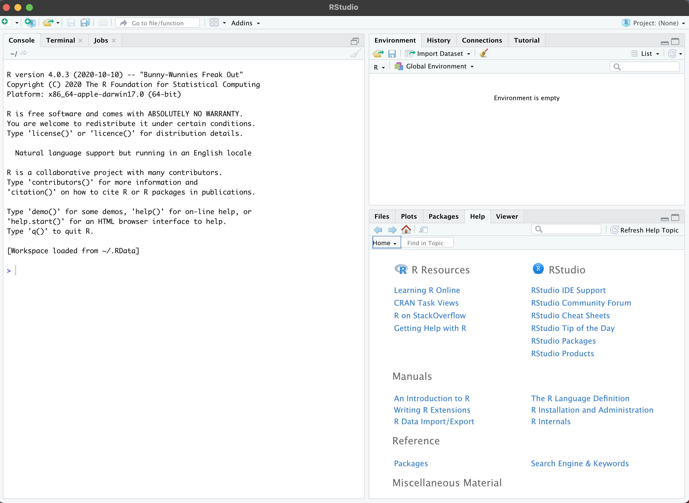
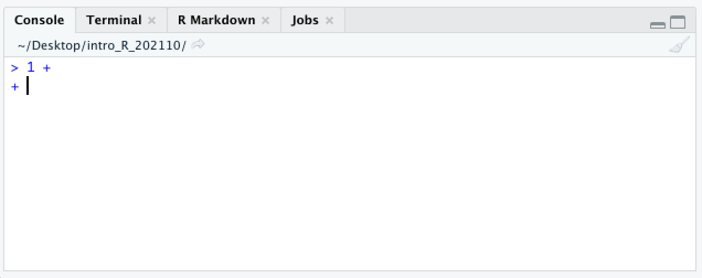
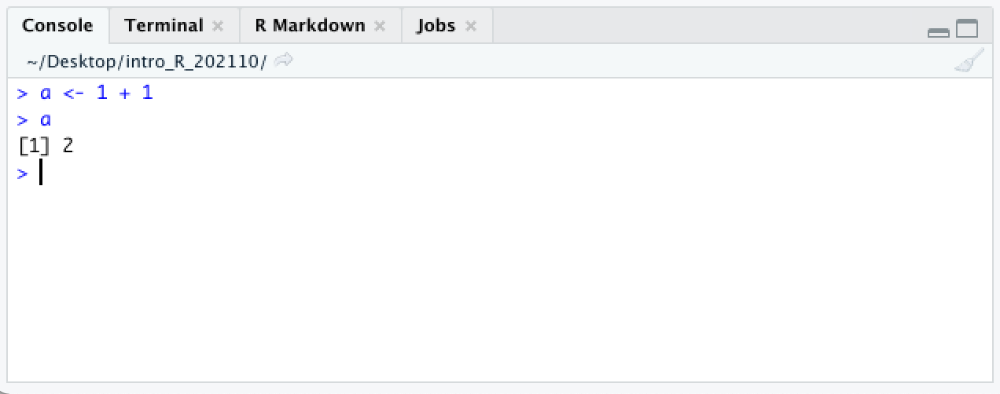
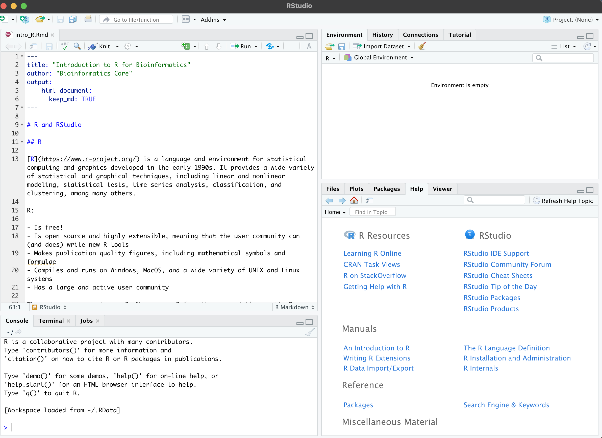

# RStudio and R notebooks

Let's get started!

**Launch RStudio.**

## RStudio

As mentioned above RStudio is a very nice, but optional, IDE for R. All of the code for this course will work just as well on the command line, but RStudio provides a number of features that improve the experience of learning to the basics of R.

Your RStudio window should look something like this:

 On the left hand side is the *console*. This is a command-line interface for R; you type a command, press enter to run it, and the result will appear below.


In R the prompt is a `>` character. When you see this character at the beginning of the line in your console, it means that R is waiting for you to type your next command.



If you press enter before finishing a command, the next line will begin with a `+` character. This lets you know that R is expecting more input.

On the right hand side, are the *workspace (or environment) browser* and the *plots / help* pane.

The workspace browser shows the objects present in the environment. Currently there are none.


If we store the result of our addition in a variable using `<-`, the result is not printed to the console.


Instead, a new value appears in the workspace browser.



The value of the variable a is the result of the addition operation 1 + 1. When typed into the console, the variable is evaluated, and R returns its value, 2.

The `<-` character pair, which looks like a left-pointing arrow, is one of two assignment operators in R. In most situations, it is equivalent to the `=` character.

The lower right pane contains the file browser, plot viewer, and help documentation, which we will be using frequently.

## R notebooks

**Create a new R notebook using the menu bar at the top: File \> New File \> R Notebook.**

A fourth pane will open up containing a template R notebook. It should look something like this:



R notebooks are a special type of *markdown* document incorporating executable R code chunks and their output, along with text that can be formatted using special characters to encode formatting like headings, bold or italic fonts, bullet points, links, and more.

Markdown is designed to be readable as-is, but it can be converted to PDF or HTML. Using an R notebook keeps any commentary, code, and figures for a project in one place, and makes it easy to generate a nicely formatted report. This web page is the product of an R notebook!

New chunks are added by clicking the *Insert Chunk* button on the toolbar or by pressing *Ctrl+Alt+I* on Windows, or *Cmd+Option+I* on Mac.

Code chunks are executed by clicking the *Run* button within the chunk or by placing your cursor inside it and pressing *Ctrl+Shift+Enter* on Windows, or *Cmd+Shift+Enter* on Mac. You can run a single line of code by placing your cursor anywhere on the line and pressing *Ctrl+Enter* on Windows, or *Cmd+Enter* on Mac.

**Create and run a new chunk with the following code:**

```{r, eval=FALSE}
2 + 2
b <- 3 + 3
```

What happened? Where did the output for each line of code go?

